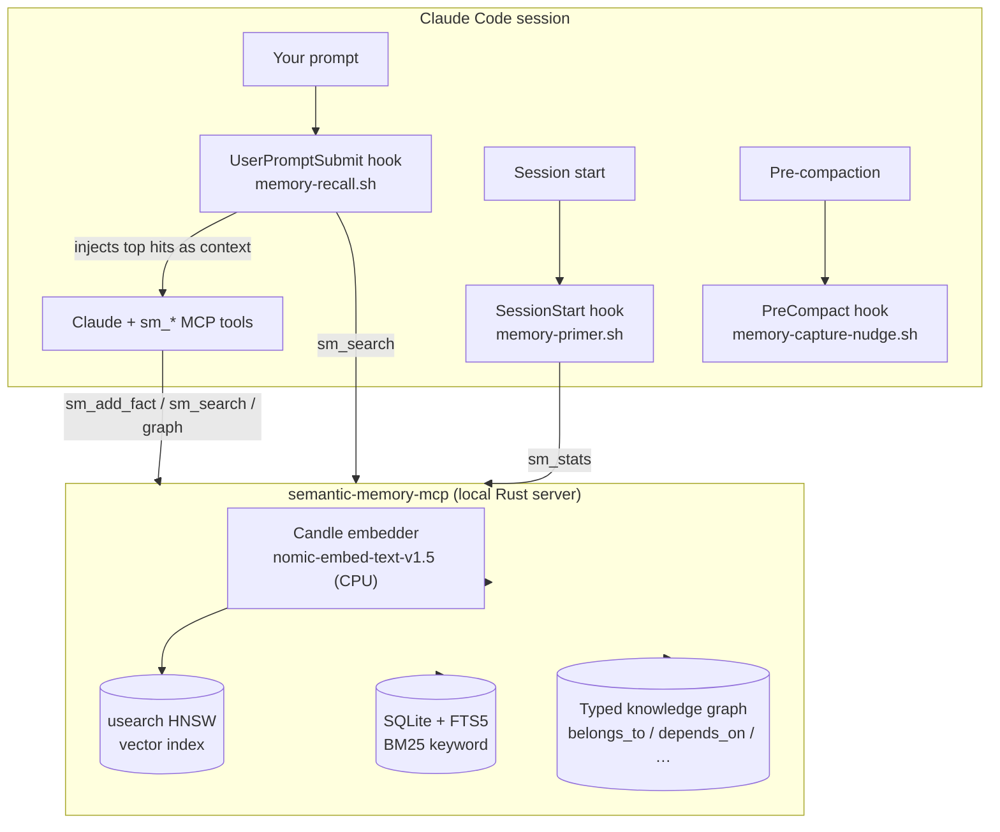
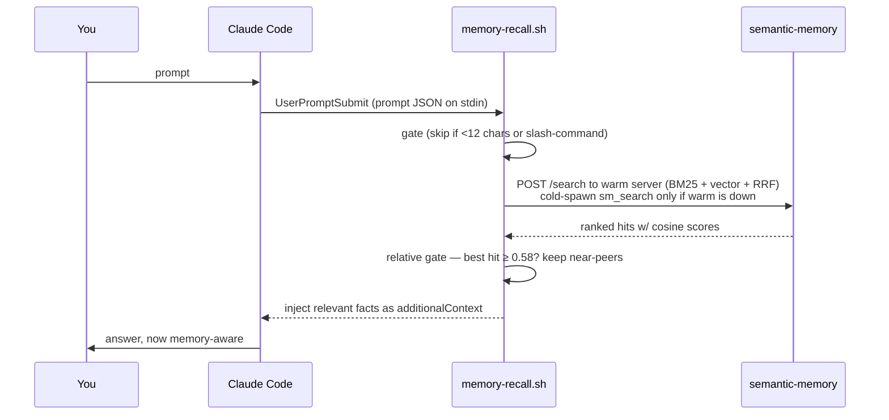
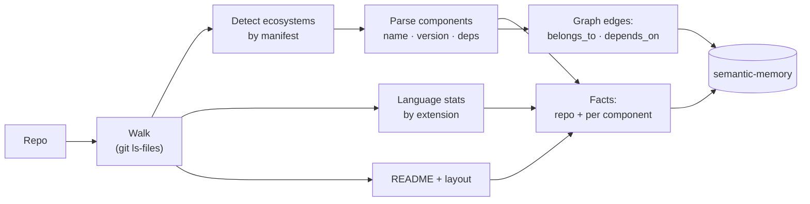

# semantic-memory-agent-kits

> Give your AI agent a **persistent, local-first memory** that recalls itself across sessions.
> One plugin per agent — Claude Code, Hermes Agent, Codex CLI — plus MCP setup kits for the next wave of coding agents.

[](https://crates.io/crates/semantic-memory-mcp)
[](#license)
[](#privacy--local-first)

AI coding agents forget everything between sessions. This kit fixes that. It wraps the
[`semantic-memory-mcp`](https://crates.io/crates/semantic-memory-mcp) server in
agent-native packages for Claude Code, Hermes Agent, and Codex CLI so that relevant
facts are automatically recalled when useful, and ships a language-agnostic ingester
that turns any repository into a searchable fact + dependency graph.

Everything runs on your machine. SQLite for storage, an in-process Rust embedder
(`nomic-embed-text-v1.5`, CPU-only), no API keys, no cloud, no telemetry.

---

## Table of contents

- [What you get](#what-you-get)
- [How it works](#how-it-works)
- [Install](#install)
- [The codebase ingester](#the-codebase-ingester)
- [Configuration](#configuration)
- [Data model](#data-model)
- [Design principles](#design-principles)
- [Troubleshooting](#troubleshooting)
- [Privacy / local-first](#privacy--local-first)

---

## What you get

| Component | Type | What it does |
|---|---|---|
| **Auto-recall** | `UserPromptSubmit` hook | Embeds each prompt, hybrid-searches your memory, injects the most relevant facts as context — only when they're actually relevant. Queries the **warm HTTP server** (embedder stays loaded) so recall is ~ms, not a cold spawn. |
| **Project-scoped primer** | `SessionStart` hook | Each session opens knowing the store's size, the recall/persist protocol, **and facts relevant to the current repo** (git-root aware from the hook's cwd). |
| **Capture nudge** | `PreCompact` hook | Before context is compacted away, reminds Claude to persist durable facts. Model-driven — nothing is auto-written. |
| **Warm HTTP server** | co-hosted by the MCP server | `run-server.sh` launches the MCP server with `--http-port` (default `1739`), so the hooks query the already-loaded embedder instead of cold-spawning a process per prompt. Fail-open: if the port is taken, stdio MCP still serves and hooks fall back to cold-spawn. |
| **`semantic-memory` MCP server** | MCP (**61 tools**: 33 lean / 48 standard / 61 full) | hybrid + **RL-routed** search (`sm_search_with_routing` / `sm_record_outcome` — policy persisted to SQLite), **bitemporal as-of** search (`sm_search_as_of`), add/get/list facts, list namespaces, **fact+neighbors with content**, graph/path/discord, **community/factor-graph**, provenance, autonomous **lifecycle**, **content-based contradiction detection** (`sm_detect_contradictions` — numeric/value/negation/antonym signals over retrieved facts), **conversation persistence** (session create/message add/hybrid search), **claim verification** (`sm_create_claim` → `sm_add_evidence` → `sm_judge_support` → `sm_verify_claim`), **supersede** facts (canonical update with audit trail; auto-filtered from search), **forget/delete** (`sm_delete_fact` / `sm_delete_namespace`), **knowledge-runtime orchestration** (classify/plan/entity-lookup via `sm_query_orchestrated`), **llm-output-parser** integration, **audit/replay** (`sm_get_search_receipt` / `sm_replay_search_receipt`), **maintenance** (`sm_reconcile` / `sm_vacuum` / `sm_reembed_all` / `sm_embeddings_are_dirty`), **bitemporal queries**, and **import**. |
| **`/memory-ingest`** | Slash command | Ingest any repo into memory (facts + dependency graph). |
| **`/memory-setup`** | Slash command | One-time: install the binary, allowlist the tools, verify. |
| **memory-capture** | Skill | Disciplined *write* path — "remember this" → dedupe, namespace, store, link. |
| **memory-curator** | Skill | Audit + reconcile the store (enumerate, find duplicates/contradictions/gaps) via append/supersede. |
| **knowledge-graph-explorer** | Skill | Traverse the graph — "what's related to X", "how are X and Y connected" — with hydrated neighbors + optional HTML viz. |
| **memory-sync** | Skill | Keep a repo's memory current — idempotent re-ingest (`--dedupe`). |
| **memory-keeper** | Subagent | Delegate heavy/multi-step memory work (audits, deep graph exploration, bulk recall) in isolation. |
| **`ingest_codebase.py`** | CLI tool | The language-agnostic ingester behind `/memory-ingest`. |

### Host support matrix

| Host | MCP tools | Auto recall | Project primer | Codebase ingest | Status |
|---|---:|---:|---:|---:|---|
| Claude Code | yes | yes | yes | yes | stable |
| Codex CLI | yes | yes | yes | yes | stable |
| Hermes Agent | yes | yes | yes | yes | local stable |
| Cursor | yes | not claimed | not claimed | manual | experimental MCP kit |
| Windsurf | yes | not claimed | not claimed | manual | experimental MCP kit |
| Cline | yes | not claimed | not claimed | manual | experimental MCP kit |
| Roo Code | yes | not claimed | not claimed | manual | experimental MCP kit |
| Continue | yes | not claimed | not claimed | manual | experimental MCP kit |
| OpenCode | yes | not claimed | not claimed | manual | experimental MCP kit |

Claim boundary: "MCP tools" means the host can call semantic-memory tools. "Auto recall" means the host injects relevant memory into model context before answering. Do not blur those two.

---

## How it works

### Architecture



### Per-prompt auto-recall



The hook hits the **warm HTTP server** first (the embedder is already loaded, so this
is ~milliseconds). If that server isn't up it falls back to cold-spawning the binary
over stdio — correct, just slower. The warm `/search` endpoint returns the fused RRF
**score** (not cosine), so on that path the gate keeps hits within `SM_RECALL_SCOREREL`
of the top score; the cold stdio path returns cosine and uses the absolute gates above.

**Why a *relative* gate?** `nomic` embeddings sit on a high baseline — even totally
unrelated text scores ~0.48–0.54 cosine. A flat threshold would inject noise on
every prompt. Instead the hook requires the **best** hit to clear `MINTOP` (0.58),
then keeps only its near-peers:

| Prompt | Best cosine | Injected? |
|---|---|---|
| "what does the AiDENs runner depend on" | 0.78 | ✅ runner + its kits |
| "remind me the eBPF security project name" | 0.68 | ✅ the canonical-name fact |
| "write a haiku about the ocean" | 0.49 | ❌ nothing (below gate) |
| "hi" / "/clear" | — | ❌ gated (too short / slash) |

Every hook **fails open**: any error, missing binary, or empty result exits cleanly
and never blocks or delays your prompt.

---

## Agent-specific plugin packages

Each agent has its own plugin directory with only the files relevant to that agent.

### Claude Code (`claude/`)
```bash
cp -r claude/plugins/semantic-memory ~/.claude/plugins/
# Or install from marketplace: claude plugins install semantic-memory
```

### Hermes Agent (`hermes/`)
```bash
cp -r hermes/skills/* ~/.hermes/skills/
cp -r hermes/agents/* ~/.hermes/agents/
cp hermes/hooks/* ~/.hermes/agent-hooks/
# Or: hermes skills install semantic-memory-hermes
```

### Codex CLI (`codex/`)
```bash
codex plugin marketplace add ./codex
codex plugin add semantic-memory@semantic-memory-codex-kit
# Or copy directly: cp -r codex/plugins/semantic-memory ~/plugins/
```

### Cursor (`cursor/`) — experimental MCP kit
```bash
cursor/scripts/setup.sh
# Optional project-local config writer:
cursor/scripts/setup.sh --write-project
cursor/scripts/doctor.py
```

Cursor support is MCP-first. It exposes the `sm_*` tools to Cursor. It does not yet claim automatic pre-prompt recall.

### MCP-only kits for other agents
```bash
windsurf/scripts/setup.sh
cline/scripts/setup.sh
roo-code/scripts/setup.sh
continue/scripts/setup.sh
opencode/scripts/setup.sh
```

These kits expose the `sm_*` tools through each host's MCP configuration surface. They intentionally do not claim automatic recall until a stable host hook/context-injection API is verified and implemented.

## Capability matrix

| Host | MCP tools | Auto recall hook | Session primer | Pre-compact hook | Rule/context injection | Context Governor receipts |
|---|---:|---:|---:|---:|---:|---:|
| Claude Code | ✅ | ✅ | ✅ | ✅ | ✅ | ✅ |
| Codex | ✅ | ✅ | ✅ | ✅/Stop fallback | ✅ | ✅ |
| Cursor | ✅ | — | — | — | workspace `.cursor/rules/*.mdc` | MCP + command assisted |
| Cline | ✅ | — | — | — | global/workspace rules | MCP + command assisted |
| Roo Code | ✅ | — | — | — | global/workspace rules | MCP + command assisted |
| Windsurf | ✅ | — | — | — | global/workspace rules | MCP + command assisted |
| Continue | ✅ | — | — | — | `rules: file://...` | MCP + command assisted |
| OpenCode | ✅ | — | — | — | `AGENTS.md` + command file | MCP + command assisted |

Boundary: dashes mean no verified transcript/prompt lifecycle hook is claimed for that host. Rule/context injection still gives the agent deterministic instructions and commands to retrieve memory and preserve receipts.

### Copy-paste installs for MCP-only kits

```bash
# Print snippets only
cursor/scripts/setup.sh
cline/scripts/setup.sh
roo-code/scripts/setup.sh
windsurf/scripts/setup.sh
continue/scripts/setup.sh
opencode/scripts/setup.sh

# Write project-local rules/configs
cursor/scripts/setup.sh --write-project /path/to/project
cline/scripts/setup.sh --write-project /path/to/project
roo-code/scripts/setup.sh --write-project /path/to/project
windsurf/scripts/setup.sh --write-project /path/to/project
continue/scripts/setup.sh --write-project /path/to/project
opencode/scripts/setup.sh --write-project /path/to/project

# Write safe global/user rules where supported
cline/scripts/setup.sh --write-user
roo-code/scripts/setup.sh --write-user
windsurf/scripts/setup.sh --write-user
continue/scripts/setup.sh --write-user
opencode/scripts/setup.sh --write-user

# Verify with receipt bundle
shared/scripts/doctor-all.py --deep
```

Generated receipts land in:

```text
~/.local/share/semantic-memory-agent-kits/receipts/
```

## Install

### Prerequisites

- **Rust toolchain** — for the one-time `cargo install semantic-memory-mcp` ([rustup.rs](https://rustup.rs)).
- **`jq`** and **`python3`** — used by the hooks and the ingester.
- First run downloads the embedding model (~550 MB) once; cached thereafter. No other network use.

### Option A — Plugin (recommended)

Claude Code:

```text
/plugin marketplace add RecursiveIntell/semantic-memory-claude-kit
/plugin install semantic-memory@semantic-memory-kit
/memory-setup
```

`/memory-setup` installs the `semantic-memory-mcp` binary and allowlists the `sm_*`
tools (one time). The MCP server and the three hooks are provided by the plugin.
Restart Claude Code once so the hooks load.

Codex CLI:

```bash
git clone https://github.com/RecursiveIntell/semantic-memory-claude-kit
cd semantic-memory-claude-kit
codex plugin marketplace add ./codex
codex plugin add semantic-memory@semantic-memory-codex-kit
```

The Codex package installs the `semantic-memory` MCP server config, skills, prompts,
setup/doctor scripts, warm recall hooks, and automatic codebase-ingest hook. Codex
uses warm HTTP port `1739` by default so it does not collide with Hermes/Claude
sidecars that may use `1738`.

### Option B — Manual (no plugins)

```bash
git clone https://github.com/RecursiveIntell/semantic-memory-claude-kit
./semantic-memory-claude-kit/install.sh
```

`install.sh` installs the binary, registers the MCP server at user scope, allowlists
the tools, and **non-destructively merges** the three hooks into
`~/.claude/settings.json`. Restart Claude Code afterward.

---

## The codebase ingester

`/memory-ingest <path>` (or `ingest_codebase.py` directly) turns a repository into
memory. It is deterministic and **language-agnostic** — facts come straight from
manifests and source structure (Grade A), never guessed.

### Pipeline



### Ecosystem support

| Ecosystem | Manifest | Name | Version | Dependencies |
|---|---|---|:--:|:--:|
| Rust | `Cargo.toml` | ✅ | ✅ | ✅ |
| Node / JS / TS | `package.json` | ✅ | ✅ | ✅ |
| Python | `pyproject.toml` | ✅ | ✅ | ✅ |
| Go | `go.mod` | ✅ | — | ✅ |
| Java / JVM | `pom.xml` | ✅ | ✅ | ✅ |
| .NET | `*.csproj` | ✅ | — | ✅ |
| PHP | `composer.json` | ✅ | ✅ | ✅ |
| Gradle / Ruby / Dart / Elixir / CMake / Swift | various | detected | — | — |
| **Anything else** | — | repo overview + language stats + layout + README always captured |

### Flags

| Flag | Purpose |
|---|---|
| `--path <repo>` | Repository root (required) |
| `--name <name>` | Project name (default: directory basename) |
| `--namespace <ns>` | Memory namespace (default: `code:<repo-slug>`) |
| `--dedupe` | Skip facts already present (idempotent re-ingest; reuses IDs so the graph still links) |
| `--dry-run` | Print the plan, write nothing |
| `--no-graph` | Facts only, skip dependency edges |
| `--max-components N` | Cap components written (default 400) |

### Example

```text
$ python3 ingest_codebase.py --path ./my-rust-workspace --dry-run
# Ingestion plan for 'my-rust-workspace'  (namespace: code:my-rust-workspace)
languages: Rust (412), Shell (6)
ecosystems: Cargo.toml
components: 14 (writing 14)
facts to write: 15
graph edges: 14 belongs_to + 18 depends_on
```

Re-running with `--dedupe` writes **0** new facts on an unchanged repo.

---

## Configuration

| Variable | Default | Purpose |
|---|---|---|
| `SEMANTIC_MEMORY_DIR` | `~/.local/share/semantic-memory` | Where the store lives (`memory.db` + vector sidecar) |
| `SEMANTIC_MEMORY_MCP_BIN` | auto-resolved | Override the binary path |
| `SEMANTIC_MEMORY_HTTP_PORT` | `1739` | Warm HTTP port the MCP server co-hosts and the hooks query. Set to `0` to disable the warm endpoint (hooks cold-spawn). Change it if another service already owns the port. |
| `SEMANTIC_MEMORY_HOOK_DEBUG` | unset | If set to a file path, hooks log each firing there (records `warm HTTP` vs `cold stdio` per call) |
| `SEMANTIC_MEMORY_TOOL_PROFILE` | `lean` | Tool profile: `lean` (33 daily-use tools), `standard` (48 + maintenance/audit), `full` (61, all tools). Lean keeps the agent's tool-selection accurate by hiding admin/audit/import tools. |
| `SM_RECALL_MINTOP` | `0.58` | Best hit must reach this cosine, or nothing is injected |
| `SM_RECALL_BAND` | `0.12` | Keep hits within this cosine distance of the best hit |
| `SM_RECALL_ABSFLOOR` | `0.54` | Hard minimum cosine regardless of band |
| `SM_RECALL_SCOREREL` | `0.5` | Fallback when the server reports no cosine: keep hits scoring ≥ this fraction of the top fused score |
| `SM_RECALL_MAXHITS` | `4` | Max facts injected per prompt |

Binary resolution order: `$SEMANTIC_MEMORY_MCP_BIN` → `PATH` → `~/.cargo/bin` → `~/.local/bin`.

The warm server is the MCP server itself: `run-server.sh` adds `--http-port`, so a single process serves both stdio MCP and the warm HTTP endpoint for the hooks. The server exposes **10 HTTP endpoints**: `/health`, `/search`, `/stats`, `/search-routed` (full RL-routed pipeline with decoder, discord, and factor-graph), `/verify-integrity` (real store integrity check), `/discord` (second-order related-item discovery), `/record-outcome` (RL routing feedback, persisted to SQLite), `/claim-versions`, `/relation-versions`, and `/episodes`. Across concurrent sessions only the first binds the port; the rest fail open and all hooks share that one warm process.

---

## Data model

- **Facts** — atomic statements stored under a **namespace** (e.g. `general`,
  `projects`, `code:<repo>`). Each gets a stable `fact:<uuid>` id.
- **Graph edges** — typed, append-only relationships between facts:
  `belongs_to`, `depends_on`, `part_of`, plus `semantic` / `temporal` / `causal`.
  The ingester builds `belongs_to` (component → repo) and `depends_on` (real
  dependency edges). Edges are idempotent; corrections use append/supersede, never
  destructive rewrite.
- **Retrieval** — hybrid: BM25 (FTS5) + vector (usearch HNSW) fused with Reciprocal
  Rank Fusion. Graph tools (`sm_topology`, `sm_community`, `sm_factor_graph`) reason
  over the edges.

---

## Design principles

- **Fail-open.** Hooks never block a prompt. Missing binary, timeout, bad JSON → exit 0, no output.
- **Local-first.** No network beyond the one-time model download. Your knowledge never leaves the machine.
- **Relative recall.** Precision over recall — unrelated prompts inject nothing.
- **No autonomous writes.** Memory is written by the model *with judgment*, nudged at the right moments — never auto-dumped by a script (which would be garbage-in, garbage-out).
- **Append/supersede.** Truth evolves by adding and superseding, not deleting.

---

## Troubleshooting

| Symptom | Fix |
|---|---|
| Hooks don't fire | Restart Claude Code or open `/hooks` once (config reloads at session start). |
| "binary not found" | `cargo install semantic-memory-mcp`, or set `SEMANTIC_MEMORY_MCP_BIN`. |
| First call is slow | One-time model download (~550 MB → `~/.cache/huggingface`). Cached after. |
| Want to see hooks firing | `export SEMANTIC_MEMORY_HOOK_DEBUG=~/sm-hooks.log` and tail it. |
| Recall too eager / too quiet | Tune `SM_RECALL_MINTOP` up/down. |
| Re-ingest duplicated facts | Use `--dedupe`. |

---

## Privacy / local-first

The SQLite database, the usearch vector index, the Candle embedding model, and the
MCP server process all run locally. There are **no** calls to any hosted service.
The only network access is a one-time model download from HuggingFace (cached). Your
knowledge base never leaves your machine.

---

## License

Apache-2.0. Built on [`semantic-memory-mcp`](https://crates.io/crates/semantic-memory-mcp)
and [`semantic-memory`](https://crates.io/crates/semantic-memory).


## Context injection for MCP-only kits

The Cursor, Windsurf, Cline, Roo Code, Continue, and OpenCode kits now include a shared context-injection layer in addition to MCP registration:

- `shared/scripts/semantic-memory-context.py` retrieves compact memory context for a prompt.
- `shared/rules/semantic-memory-context.md` is the host-neutral rule text.
- `shared/scripts/install-context-rules.py` installs host-specific rule/instruction files.

Examples:

```bash
# workspace rule for a project
shared/scripts/install-context-rules.py cursor --scope workspace --workspace /path/to/project
shared/scripts/install-context-rules.py cline --scope workspace --workspace /path/to/project
shared/scripts/install-context-rules.py roo-code --scope workspace --workspace /path/to/project
shared/scripts/install-context-rules.py windsurf --scope workspace --workspace /path/to/project
shared/scripts/install-context-rules.py continue --scope workspace --workspace /path/to/project
shared/scripts/install-context-rules.py opencode --scope workspace --workspace /path/to/project

# global rule where supported by the host
shared/scripts/install-context-rules.py cline --scope global
shared/scripts/install-context-rules.py roo-code --scope global
shared/scripts/install-context-rules.py windsurf --scope global
shared/scripts/install-context-rules.py continue --scope global
shared/scripts/install-context-rules.py opencode --scope global
```

Host boundaries:

- Claude Code and Codex have real hook-based recall.
- Cursor/Cline/Roo/Windsurf/Continue/OpenCode use documented rule/config surfaces plus the shared context command unless/until a stable pre-prompt hook API is available for that host.
- Context retrieved from memory is recall to consider, not ground truth; current files and live tool output outrank memory.


## Context Governor companion

The MCP-only kits also include Context Governor as a companion for receipt-backed compaction:

- `shared/scripts/context-governor-mcp.py` exposes receipt tools: `cg_list_receipts`, `cg_search`, `cg_expand`, and `cg_diff_receipt`.
- `shared/scripts/context-governor-compact.py` compacts an exported transcript JSON and stores a receipt.
- `shared/rules/context-governor.md` tells agents how to use receipts and exact fallback safely.
- MCP config examples now include both `semantic-memory` and `context-governor` servers.

Capability boundary:

- Claude Code/Codex can use pre-compact hooks where supported.
- Other agents get MCP receipt search/expand plus rule/command-assisted compaction unless their hook API exposes transcript messages.
- Receipts prove recoverability of context, not task success.
