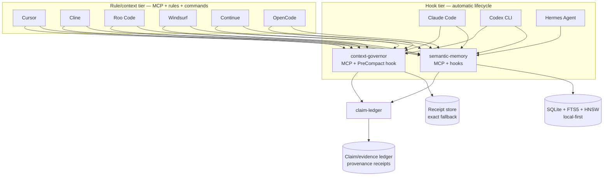
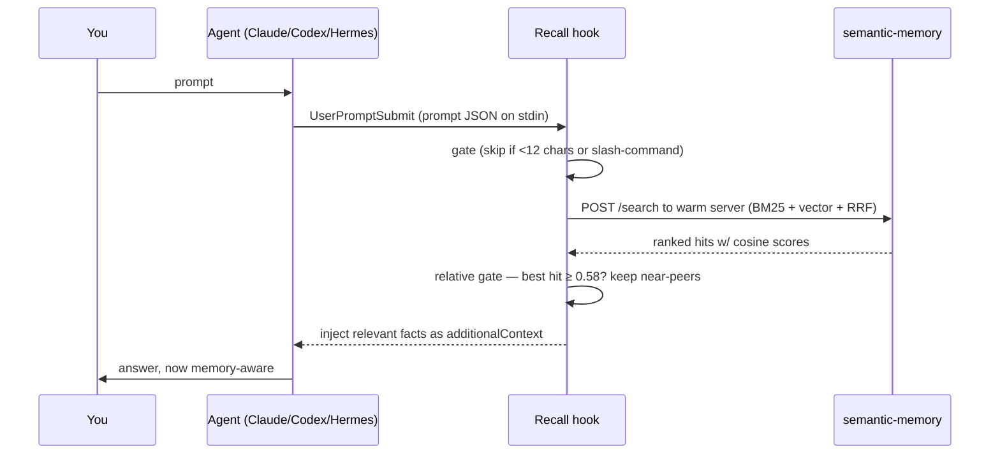
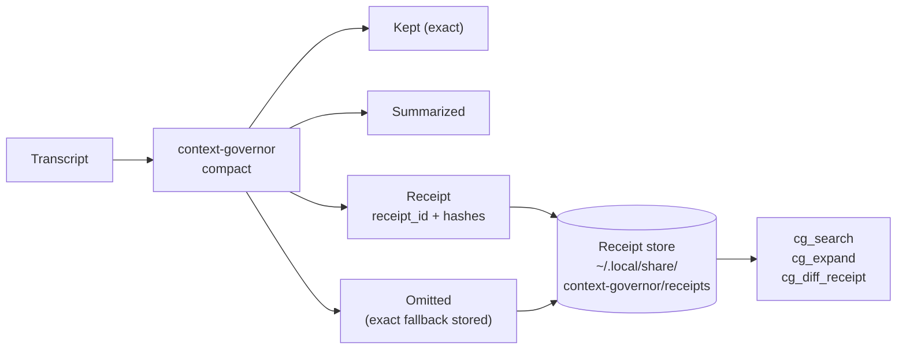
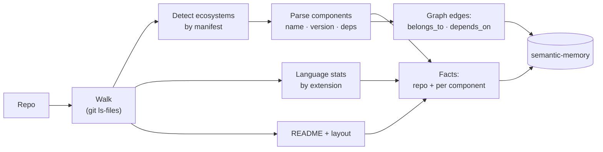

# agent-memory-kits

> **Persistent local-first memory, receipt-backed compaction, and claim/evidence provenance — for every AI coding agent.**
> One repo, three companion MCP servers, nine agent hosts.

[](https://crates.io/crates/semantic-memory-mcp)
[](https://crates.io/crates/semantic-memory)
[](https://crates.io/crates/context-governor)
[](https://crates.io/crates/claim-ledger)
[](#license)
[](#privacy--local-first)

AI coding agents forget everything between sessions. This repo fixes that.

It wraps three local-first Rust tools — [`semantic-memory-mcp`](https://crates.io/crates/semantic-memory-mcp), [`context-governor`](https://github.com/RecursiveIntell/Libraries), and [`claim-ledger`](https://github.com/RecursiveIntell/Libraries) — into agent-native packages so that:

- relevant facts are automatically recalled when useful (hooked agents)
- context compaction preserves high-risk spans with searchable exact-fallback receipts
- material agent assertions can be backed by claim/evidence/provenance receipts
- any repository can be ingested into a searchable fact + dependency graph

Everything runs on your machine. SQLite for storage, an in-process Rust embedder (`nomic-embed-text-v1.5`, CPU-only), no API keys, no cloud, no telemetry.

---

## Table of contents

- [What this repo is](#what-this-repo-is)
- [Architecture](#architecture)
- [Capability matrix](#capability-matrix)
- [Install](#install)
- [The three MCP companions](#the-three-mcp-companions)
- [The codebase ingester](#the-codebase-ingester)
- [Context injection for MCP-only hosts](#context-injection-for-mcp-only-hosts)
- [Receipts and benchmarks](#receipts-and-benchmarks)
- [Configuration](#configuration)
- [Data model](#data-model)
- [Design principles](#design-principles)
- [Troubleshooting](#troubleshooting)
- [Privacy / local-first](#privacy--local-first)
- [License](#license)

---

## What this repo is

A collection of plugins and setup kits that give AI coding agents:

1. **Persistent memory** — semantic-memory-mcp: hybrid BM25 + vector search, knowledge graphs, conversation recall, contradiction detection, bitemporal as-of queries, claim verification, and autonomous lifecycle. 61 MCP tools (33 lean / 48 standard / 61 full).

2. **Receipt-backed compaction** — context-governor: deterministic pre-compaction that preserves active tasks and high-risk evidence, summarizes lower-risk context, and stores exact fallback records that can be searched and expanded later. Never silently loses context.

3. **Claim/evidence provenance** — claim-ledger: a deterministic, local-first ledger that creates receipts for all material operations. Claims get evidence, support judgments, contradiction resolution, and export bundles for audit.

### Repo structure

```
agent-memory-kits/
├── claude/              # Claude Code plugin (marketplace + plugin)
├── codex/               # Codex CLI plugin (marketplace + plugin)
├── hermes/              # Hermes Agent plugin
├── cursor/              # Cursor MCP + context-injection kit
├── windsurf/            # Windsurf MCP + context-injection kit
├── cline/               # Cline MCP + context-injection kit
├── roo-code/            # Roo Code MCP + context-injection kit
├── continue/            # Continue MCP + context-injection kit
├── opencode/            # OpenCode MCP + context-injection kit
├── shared/
│   ├── scripts/         # shared MCP wrappers, installers, doctors, benchmarks
│   ├── rules/           # host-neutral rule text injected into agent configs
│   └── snippets/        # reusable MCP config snippets
├── scripts/
│   └── validate-all-kits.sh
└── README.md
```

### Two tiers of integration



- **Hook tier** (Claude Code, Codex, Hermes): real lifecycle hooks inject memory at prompt/session/compaction events. Agents don't need to be told to recall — it happens automatically.
- **Rule/context tier** (Cursor, Cline, Roo Code, Windsurf, Continue, OpenCode): MCP tools plus host-native rule files and a deterministic context command. Agents get behavioral guidance to retrieve memory and preserve receipts. No false claim of hidden pre-prompt hooks.

---

## Architecture

### Per-prompt auto-recall (hooked agents)



The hook hits the **warm HTTP server** first (the embedder is already loaded, so this is ~milliseconds). If that server isn't up it falls back to cold-spawning the binary over stdio — correct, just slower.

**Why a relative gate?** `nomic` embeddings sit on a high baseline — even totally unrelated text scores ~0.48–0.54 cosine. A flat threshold would inject noise on every prompt. Instead the hook requires the **best** hit to clear `MINTOP` (0.58), then keeps only its near-peers:

| Prompt | Best cosine | Injected? |
|---|---|---|
| "what does the AiDENs runner depend on" | 0.78 | yes — runner + its kits |
| "remind me the eBPF security project name" | 0.68 | yes — the canonical-name fact |
| "write a haiku about the ocean" | 0.49 | no — below gate |
| "hi" / "/clear" | — | no — gated (too short / slash) |

Every hook **fails open**: any error, missing binary, or empty result exits cleanly and never blocks or delays your prompt.

### Receipt-backed compaction (context-governor)



Context Governor classifies transcript spans, preserves active tasks and high-risk evidence, summarizes lower-risk context, and stores exact fallback records. When omitted text matters later, `cg_search` and `cg_expand` recover it from the receipt store.

---

## Capability matrix

| Host | semantic-memory | Auto recall | Session primer | Pre-compact hook | Context Governor | ClaimLedger | TurboQuant | Rule/context injection |
|---|---|---|---|---|---|---|---|---|
| Claude Code | MCP + hooks | yes | yes | yes | MCP + hook | MCP | env flag | yes |
| Codex CLI | MCP + hooks | yes | yes | yes / Stop fallback | MCP + hook | MCP | env flag | yes |
| Hermes Agent | MCP + hooks | yes | yes | — | MCP | MCP | env flag | yes |
| Cursor | MCP | — | — | — | MCP | MCP | env flag | workspace `.cursor/rules/*.mdc` |
| Cline | MCP | — | — | — | MCP | MCP | env flag | global/workspace rules |
| Roo Code | MCP | — | — | — | MCP | MCP | env flag | global/workspace rules |
| Windsurf | MCP | — | — | — | MCP | MCP | env flag | global/workspace rules |
| Continue | MCP | — | — | — | MCP | MCP | env flag | `rules: file://...` |
| OpenCode | MCP | — | — | — | MCP | MCP | env flag | `AGENTS.md` + command file |

**Boundary**: dashes mean no verified transcript/prompt lifecycle hook is claimed for that host. Rule/context injection still gives the agent deterministic instructions and commands to retrieve memory and preserve receipts. Receipts prove recoverability and provenance, not task success.

**TurboQuant**: set `SEMANTIC_MEMORY_TURBO_QUANT=1` in the MCP server env to enable compressed vector candidate generation with exact f32 rerank. Requires the `turbo-quant-codec` feature in semantic-memory-mcp.

---

## Install

### Prerequisites

- **Rust toolchain** — for `cargo install semantic-memory-mcp`, `cargo install context-governor`, `cargo install claim-ledger` ([rustup.rs](https://rustup.rs)).
- **`python3`** — used by hooks, ingester, and setup scripts.
- First run downloads the embedding model (~550 MB) once; cached thereafter. No other network use.

### Claude Code

```text
/plugin marketplace add RecursiveIntell/agent-memory-kits
/plugin install semantic-memory@semantic-memory-kit
/memory-setup
```

Restart Claude Code once so hooks load. `/memory-setup` installs the binary and allowlists tools.

### Codex CLI

```bash
git clone https://github.com/RecursiveIntell/agent-memory-kits
cd agent-memory-kits
codex plugin marketplace add ./codex
codex plugin add semantic-memory@semantic-memory-codex-kit
```

The Codex plugin installs the MCP server config, skills, prompts, warm recall hooks, automatic codebase-ingest hook, context-governor MCP, and claim-ledger MCP. Codex uses warm HTTP port `1739` by default so it does not collide with Hermes/Claude sidecars on `1738`.

### Hermes Agent

```bash
cp -r hermes/skills/* ~/.hermes/skills/
cp -r hermes/agents/* ~/.hermes/agents/
cp hermes/scripts/* ~/.hermes/scripts/
```

### MCP-only kits (Cursor, Cline, Roo Code, Windsurf, Continue, OpenCode)

```bash
git clone https://github.com/RecursiveIntell/agent-memory-kits
cd agent-memory-kits

# Print MCP config snippets
cursor/scripts/setup.sh
cline/scripts/setup.sh
roo-code/scripts/setup.sh
windsurf/scripts/setup.sh
continue/scripts/setup.sh
opencode/scripts/setup.sh

# Write project-local rules + MCP config
cursor/scripts/setup.sh --write-project /path/to/project
cline/scripts/setup.sh --write-project /path/to/project

# Write safe global/user rules where supported
cline/scripts/setup.sh --write-user
roo-code/scripts/setup.sh --write-user
windsurf/scripts/setup.sh --write-user
continue/scripts/setup.sh --write-user
opencode/scripts/setup.sh --write-user

# Dry run before writing
cursor/scripts/setup.sh --dry-run --write-project /path/to/project

# Verify everything
shared/scripts/doctor-all.py --deep
```

---

## The three MCP companions

### semantic-memory

The core memory server. 61 MCP tools (33 lean / 48 standard / 61 full):

- **LLM output parsing**: `sm_parse_json`, `sm_parse_json_value`, `sm_repair_json`, `sm_strip_think_tags`, `sm_parse_string_list`, `sm_parse_choice`, `sm_parse_number` — production-grade parsing of LLM output without an additional LLM call. Handles think blocks, markdown fences, malformed JSON, trailing text.
- **Search**: hybrid BM25 + vector (usearch HNSW) fused with Reciprocal Rank Fusion, RL-routed search (`sm_search_with_routing`), bitemporal as-of search (`sm_search_as_of`), conversation message search (`sm_search_conversations`)
- **Facts**: add, get, list, supersede (canonical update with audit trail; auto-filtered from search), delete (hard, approval-gated)
- **Graph**: typed edges (belongs_to, depends_on, semantic, temporal, causal), path traversal, community detection, factor-graph belief propagation, discord second-order discovery
- **Contradictions**: content-based detection (numeric/value/negation/antonym signals) — no pre-asserted edges needed
- **Claims**: create claim, add evidence, judge support, verify claim (returns promote/reject/quarantine/defer by risk class)
- **Conversation**: session create, message add, hybrid search over past sessions
- **Lifecycle**: autonomous forget/compress candidates, reconcile, vacuum, re-embed stale vectors
- **Audit/replay**: search receipts, replay prior searches to verify recall stability

### context-governor

Receipt-backed deterministic context compaction. 4 MCP tools:

- `cg_list_receipts` — list stored compaction receipt IDs
- `cg_search` — search receipts and exact fallback content
- `cg_expand` — expand exact fallback text for a receipt item
- `cg_diff_receipt` — inspect kept/summarized/omitted/quarantined counts and warnings

The compaction command (`context-governor-compact.py`) accepts an exported transcript JSON, classifies spans, preserves high-risk context, summarizes lower-risk context, stores exact fallback records, and writes a receipt with hashes and token counts.

### claim-ledger

Deterministic, local-first claim/evidence/provenance ledger. 5 MCP tools:

- `cl_run` — run the full ClaimLedger pipeline on a directory
- `cl_inspect` — inspect a claims JSONL file
- `cl_validate` — validate a ClaimLedger output directory
- `cl_export_bundle` — export a generic app-agnostic bundle
- `cl_ledger_verify` — verify the append-only JSONL ledger digest chain

A claim with evidence is stronger than a fact without. Receipts prove provenance, not task success.

---

## The codebase ingester

`/memory-ingest <path>` (or `ingest_codebase.py` directly) turns a repository into memory. It is deterministic and **language-agnostic** — facts come straight from manifests and source structure, never guessed.



| Ecosystem | Manifest | Name | Version | Dependencies |
|---|---|---|:--:|:--:|
| Rust | `Cargo.toml` | yes | yes | yes |
| Node / JS / TS | `package.json` | yes | yes | yes |
| Python | `pyproject.toml` | yes | yes | yes |
| Go | `go.mod` | yes | — | yes |
| Java / JVM | `pom.xml` | yes | yes | yes |
| .NET | `*.csproj` | yes | — | yes |
| PHP | `composer.json` | yes | yes | yes |
| Gradle / Ruby / Dart / Elixir / CMake / Swift | various | detected | — | — |
| **Anything else** | — | repo overview + language stats + layout + README always captured |

Re-running with `--dedupe` writes **0** new facts on an unchanged repo.

---

## Context injection for MCP-only hosts

Cursor, Cline, Roo Code, Windsurf, Continue, and OpenCode get a shared context-injection layer in addition to MCP registration:

- `shared/scripts/semantic-memory-context.py` — prompt in, compact recall block out; warm HTTP first, stdio MCP fallback
- `shared/rules/semantic-memory-context.md` — host-neutral rule text (recall protocol, bitemporal as-of guidance, save discipline)
- `shared/rules/context-governor.md` — compaction guidance (preserve high-risk, store receipts, expand when needed)
- `shared/rules/claim-ledger.md` — provenance guidance (back material assertions with claims and evidence)
- `shared/rules/release-gate.md` — gate discipline (run fmt/clippy/test before claiming done, store receipts)
- `shared/scripts/install-context-rules.py` — installs host-specific rule/instruction files

---

## Receipts and benchmarks

### Doctor receipt bundles

```bash
shared/scripts/doctor-all.py --deep
```

Runs all doctors (semantic-memory health, context-governor status, claim-ledger checks, MCP tools/list, config paths, optional compaction smoke) and writes a JSON receipt bundle to:

```
~/.local/share/semantic-memory-agent-kits/receipts/
```

### Retrieval quality benchmarks

```bash
shared/scripts/benchmark-retrieval.py
```

Runs `sm-bench` against the warm HTTP server and stores JSONL quality receipts (precision, recall, latency, namespace accuracy).

### Compaction benchmarks

```bash
shared/scripts/benchmark-context-governor.py --messages 40
```

Measures compaction latency, search latency, receipt ID, and compact/original token ratio.

### Release gate

`shared/rules/release-gate.md` instructs agents to run `cargo fmt --check`, `cargo clippy -- -D warnings`, and `cargo test --workspace` before claiming done, and to store gate receipts. A claim of completion without gate receipts is not completion.

---

## Configuration

| Variable | Default | Purpose |
|---|---|---|
| `SEMANTIC_MEMORY_DIR` | `~/.local/share/semantic-memory` | Where the store lives (`memory.db` + vector sidecar) |
| `SEMANTIC_MEMORY_MCP_BIN` | auto-resolved | Override the binary path |
| `SEMANTIC_MEMORY_HTTP_PORT` | `1739` | Warm HTTP port. Set to `0` to disable (hooks cold-spawn). |
| `SEMANTIC_MEMORY_TOOL_PROFILE` | `lean` | `lean` (33 tools), `standard` (48), `full` (61) |
| `SEMANTIC_MEMORY_TURBO_QUANT` | unset | Set to `1` to enable TurboQuant compressed search |
| `SEMANTIC_MEMORY_TURBO_QUANT_BITS` | `8` | TurboQuant polar angle bits |
| `SEMANTIC_MEMORY_TURBO_QUANT_PROJECTIONS` | `16` | TurboQuant QJL projection count |
| `SEMANTIC_MEMORY_HOOK_DEBUG` | unset | If set to a file path, hooks log each firing there |
| `SM_RECALL_MINTOP` | `0.58` | Best hit must reach this cosine, or nothing is injected |
| `SM_RECALL_BAND` | `0.12` | Keep hits within this cosine distance of the best hit |
| `SM_RECALL_ABSFLOOR` | `0.54` | Hard minimum cosine regardless of band |
| `SM_RECALL_SCOREREL` | `0.5` | Fallback when server reports no cosine: keep hits scoring >= this fraction of top fused score |
| `SM_RECALL_MAXHITS` | `4` | Max facts injected per prompt |
| `CONTEXT_GOVERNOR_STORE` | `~/.local/share/context-governor/receipts` | Where compaction receipts are stored |
| `CONTEXT_GOVERNOR_TARGET_TOKENS` | `12000` | Default compact target |
| `CONTEXT_GOVERNOR_BUDGET_MODE` | `hard_cascade` | `hard_cascade`, `soft_warn`, or `fail_closed` |

Binary resolution order: `$SEMANTIC_MEMORY_MCP_BIN` -> `PATH` -> `~/.cargo/bin` -> `~/.local/bin`.

The warm server is the MCP server itself: `run-server.sh` adds `--http-port`, so a single process serves both stdio MCP and the warm HTTP endpoint for the hooks. Across concurrent sessions only the first binds the port; the rest fail open and all hooks share that one warm process.

---

## Data model

- **Facts** — atomic statements stored under a **namespace** (e.g. `general`, `projects`, `code:<repo>`). Each gets a stable `fact:<uuid>` id.
- **Graph edges** — typed, append-only relationships between facts: `belongs_to`, `depends_on`, `part_of`, plus `semantic` / `temporal` / `causal`. Edges are idempotent; corrections use append/supersede, never destructive rewrite.
- **Retrieval** — hybrid: BM25 (FTS5) + vector (usearch HNSW) fused with Reciprocal Rank Fusion. Graph tools (`sm_topology`, `sm_communities`, `sm_factor_graph`) reason over the edges.
- **Receipts** — context-governor stores compacted transcript receipts with exact fallback. claim-ledger stores claim/evidence/provenance receipts with digest chain verification.

---

## Design principles

- **Fail-open.** Hooks never block a prompt. Missing binary, timeout, bad JSON -> exit 0, no output.
- **Local-first.** No network beyond the one-time model download. Your knowledge never leaves the machine.
- **Relative recall.** Precision over recall — unrelated prompts inject nothing.
- **No autonomous writes.** Memory is written by the model *with judgment*, nudged at the right moments — never auto-dumped by a script.
- **Append/supersede.** Truth evolves by adding and superseding, not deleting.
- **Receipts or it didn't happen.** Compaction, claims, benchmarks, and doctor checks all produce receipts. A claim of completion without gate receipts is not completion.

---

## Troubleshooting

| Symptom | Fix |
|---|---|
| Hooks don't fire | Restart Claude Code or open `/hooks` once (config reloads at session start). |
| "binary not found" | `cargo install semantic-memory-mcp`, or set `SEMANTIC_MEMORY_MCP_BIN`. |
| First call is slow | One-time model download (~550 MB -> `~/.cache/huggingface`). Cached after. |
| Want to see hooks firing | `export SEMANTIC_MEMORY_HOOK_DEBUG=~/sm-hooks.log` and tail it. |
| Recall too eager / too quiet | Tune `SM_RECALL_MINTOP` up/down. |
| Re-ingest duplicated facts | Use `--dedupe`. |
| MCP-only host not recalling | Rule/context injection is guidance, not a hook. Run `shared/scripts/semantic-memory-context.py --prompt "..."` to test. |

---

## Privacy / local-first

The SQLite database, the usearch vector index, the Candle embedding model, the context-governor receipt store, the claim-ledger ledger, and all MCP server processes run locally. There are **no** calls to any hosted service. The only network access is a one-time model download from HuggingFace (cached). Your knowledge base never leaves your machine.

---

## License

Apache-2.0. Built on [`semantic-memory-mcp`](https://crates.io/crates/semantic-memory-mcp), [`semantic-memory`](https://crates.io/crates/semantic-memory), [`context-governor`](https://github.com/RecursiveIntell/Libraries), and [`claim-ledger`](https://github.com/RecursiveIntell/Libraries).