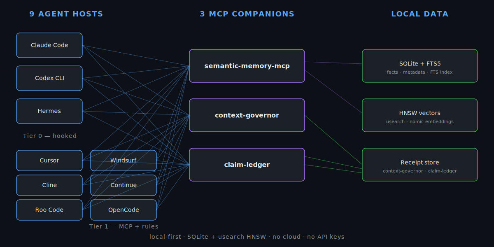
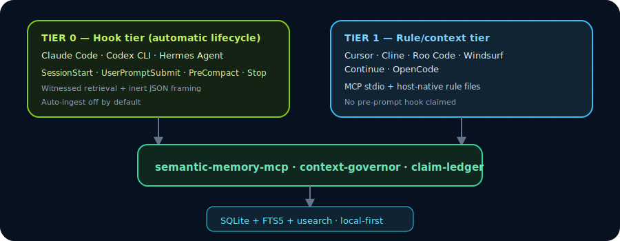
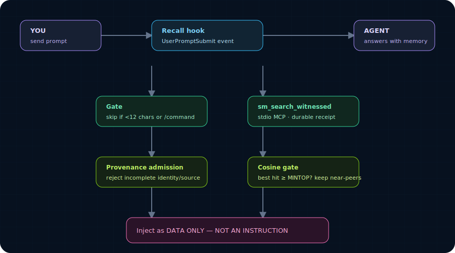
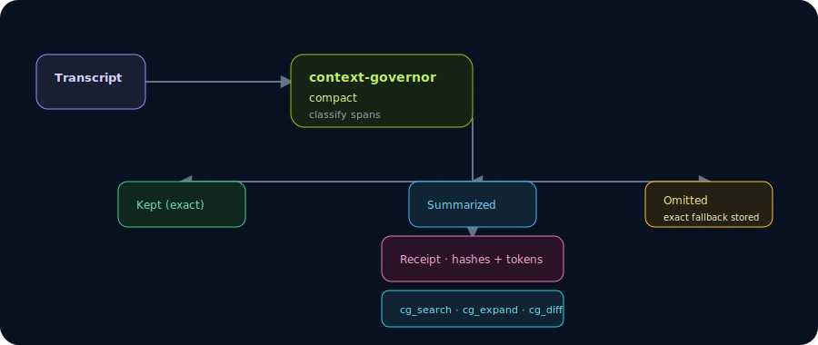
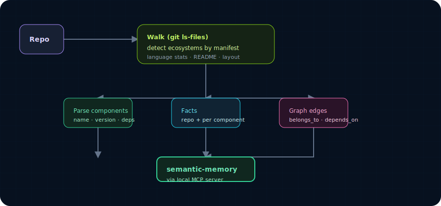

# agent-memory-kits

> **Persistent local-first memory, receipt-backed compaction, and claim/evidence provenance — for every AI coding agent.**
> One repo, three companion MCP servers, nine agent hosts.

[](https://crates.io/crates/semantic-memory-mcp)
[](https://crates.io/crates/semantic-memory)
[](https://crates.io/crates/context-governor)
[](https://crates.io/crates/claim-ledger)
[](./#capability-matrix)
[](#license)
[](#privacy--local-first)

## Verified release surface

The companion packages are published independently from this kit. The versions below were checked against crates.io on **2026-07-18**; badges remain the live version indicator.

| Package | Published version | Role | Source / release boundary |
|---|---:|---|---|
| [`semantic-memory`](https://crates.io/crates/semantic-memory) | `0.5.14` | SQLite/FTS5 + vector memory library | [release source](https://github.com/RecursiveIntell/semantic-memory/tree/feat/full-integration) |
| [`semantic-memory-mcp`](https://crates.io/crates/semantic-memory-mcp) | `0.5.6` | MCP transport, tool profiles, and loopback HTTP | [release source](https://github.com/RecursiveIntell/semantic-memory-mcp/tree/main) |
| [`mnemes`](https://crates.io/crates/mnemes) | `0.1.1` | Multi-device memory control plane | [release source](https://github.com/RecursiveIntell/mnemes) |
| [`context-governor`](https://crates.io/crates/context-governor) | `0.2.0` | Deterministic receipt-backed compaction | [registry package](https://crates.io/crates/context-governor) |
| [`claim-ledger`](https://crates.io/crates/claim-ledger) | `0.2.1` | Claim/evidence/provenance ledger | [Libraries source](https://github.com/RecursiveIntell/Libraries/tree/main/claim-ledger) |

Release facts are source-reported until reproduced locally. For a current runtime surface, use `tools/list` on the configured MCP binary; profile counts are deliberately not frozen in this README.



AI coding agents forget everything between sessions. This repo fixes that.

## The memory builds over time

Day 1 is empty. That is by design, not a bug. The recall hook gates on `SM_RECALL_MINTOP=0.58` cosine — an empty store returns nothing, and the hook fails open (no output, no block) on every prompt until the store has facts worth recalling. The system is not failing; it is waiting.

The product is the compounding curve, not the first session.

```
day 1        day 7         day 30        day 90+
  |           |              |              |
  o-----------o--------------o--------------o-->
  install     ~50 facts     ~500 facts    ~5000+ facts
  empty store starting to   recall        recall
              fill          useful        indispensable
```

**What to expect, honestly:**

- **Day 1 (install day).** Empty store. The recall hook fires on every prompt and returns nothing every time. The MCP tools work. The doctor passes. Nothing to recall. This is correct.
- **Days 2–14 (filling in).** The agent saves facts as it works — with judgment, never auto-dumped. `/memory-ingest <repo>` on each repo you touch populates the codebase namespace fast. Recall starts firing on the prompts where it has a hit, ignoring the rest. The user notices on a few specific questions.
- **Days 15–60 (useful).** Recall fires on a meaningful fraction of prompts. The agent knows your stack, your conventions, your open questions. You stop restating context the agent should already have.
- **Days 60+ (indispensable).** The agent answers cross-session questions that you would have to look up manually. Failed approaches don't get retried. Decisions don't get re-debated. The store is large enough that the cosine gate fires often and the answers are accurate.

**What speeds the curve (do these on day 1):**

```bash
# 1. Install the three companion MCP servers
cargo install semantic-memory-mcp context-governor claim-ledger

# 2. Install a host plugin — Claude Code shown; the same shape works for all 9 hosts
/plugin marketplace add RecursiveIntell/agent-memory-kits
/plugin install semantic-memory@semantic-memory-kit
/memory-setup

# 3. Ingest the repos you actually work in
/memory-ingest .
/memory-ingest ../other-repo

# 4. Restart the host so hooks load. Then work normally.
```

The hooked host's recall hook queries the warm HTTP server (BM25 + vector + RRF, fail-open) and injects only hits that clear `SM_RECALL_MINTOP=0.58`. A second-prompt later, the same facts come back without re-indexing. Receipts are written to `~/.local/share/semantic-memory-agent-kits/receipts/`. The day-1 install is the same in every README; the difference between day 1 and day 90 is what you do between.

---

## Table of contents

- [What this repo is](#what-this-repo-is)
- [Architecture](#architecture)
- [Capability matrix](#capability-matrix)
- [Per-host docs](#per-host-docs)
- [Install](#install)
- [RecursiveIntell Pro](#recursiveintell-pro)
- [The three MCP companions](#the-three-mcp-companions)
- [The codebase ingester](#the-codebase-ingester)
- [Context injection for MCP-only hosts](#context-injection-for-mcp-only-hosts)
- [Receipts and benchmarks](#receipts-and-benchmarks)
- [Configuration](#configuration)
- [Data model](#data-model)
- [Design principles](#design-principles)
- [Design tokens](#design-tokens)
- [Troubleshooting](#troubleshooting)
- [Privacy / local-first](#privacy--local-first)
- [License](#license)

---

## What this repo is

A collection of plugins and setup kits that give AI coding agents:

1. **Persistent memory** — semantic-memory-mcp: hybrid BM25 + vector search, knowledge graphs, conversation recall, contradiction detection, bitemporal as-of queries, claim verification, and autonomous lifecycle. Profile-based tool counts (run `generate-tool-surface-docs.py` for current).

2. **Receipt-backed compaction** — context-governor: deterministic pre-compaction that preserves active tasks and high-risk evidence, summarizes lower-risk context, and stores exact fallback records that can be searched and expanded later. Never silently loses context.

3. **Claim/evidence provenance** — claim-ledger: a deterministic, local-first ledger that creates receipts for all material operations. Claims get evidence, support judgments, contradiction resolution, and export bundles for audit.

4. **Typed receipt spine** — shared hook receipts use an `llm-tool-runtime`-compatible `ToolReceipt` shape plus stack-ids-style `trace_ctx`, stable SHA-256 digests, and compact status fields. This prevents host hooks from drifting into incompatible ad-hoc JSON.

### Repo structure

```
agent-memory-kits/
├── README.md
├── claude/                            # Claude Code plugin (Tier 0, reference impl)
│   ├── README.md
│   ├── .claude-plugin/marketplace.json
│   ├── install.sh
│   └── plugins/semantic-memory/
│       ├── README.md                  # (this PR — see Per-host docs)
│       ├── .claude-plugin/plugin.json
│       ├── .mcp.json
│       ├── agents/memory-keeper.md
│       ├── commands/{memory-setup,memory-ingest}.md
│       ├── hooks/{memory-recall,memory-primer,memory-capture-nudge,_resolve}.sh
│       ├── scripts/                   # MCP wrappers, doctor, ingest, proof/audit helpers
│       └── skills/                    # capture, curator, maintenance, sync, proof, compaction, ...
├── codex/                             # Codex CLI plugin (Tier 0, reference impl)
│   ├── README.md                      # (this PR — see Per-host docs)
│   ├── .agents/plugins/marketplace.json
│   └── plugins/semantic-memory/
│       ├── README.md
│       ├── .codex-plugin/plugin.json
│       ├── .mcp.json
│       ├── agents/memory-keeper.md
│       ├── assets/icon.svg
│       ├── hooks/                     # 7 .py hooks (recall, primer, capture, ingest, compact)
│       ├── prompts/                   # 11 prompts (search, capture, curator, doctor, ...)
│       ├── scripts/                   # MCP wrappers, doctor, ingest, eval, audit, install
│       └── skills/                    # 13 SKILL.md (each with agents/openai.yaml)
├── hermes/                            # Hermes Agent plugin (Tier 0, reference impl)
│   ├── README.md                      # (this PR — see Per-host docs)
│   ├── plugin.json
│   ├── agents/memory-keeper.md
│   ├── commands/{memory-setup,memory-ingest,memory-gaps,proof-packet}.md
│   ├── scripts/                       # MCP wrappers, doctor, ingest, proof/audit/admin helpers
│   └── skills/                        # capture, curator, maintenance, sync, proof, compaction, ...
├── pro/                               # RecursiveIntell Pro overlay plugin
│   ├── plugin.json                    # packaged Pro manifest, no missing local refs
│   ├── install.py                     # license-verified installer
│   ├── license-server.py              # local/managed license server
│   ├── commands/                      # release-gate, verify-patch, proof-packet
│   ├── scripts/                       # claim-ledger, forge-admin, agent-guard MCP wrappers
│   └── skills/                        # release-gate + claim-provenance skills
├── cursor/                            # Cursor MCP + context-injection kit (Tier 1)
│   ├── README.md
│   ├── mcp.json.example
│   └── scripts/{setup,doctor,run-server}.sh
├── windsurf/                          # Windsurf MCP + context-injection kit (Tier 1)
│   ├── README.md
│   ├── mcp_config.json.example
│   └── scripts/{setup,doctor,run-server}.sh
├── cline/                             # Cline MCP + context-injection kit (Tier 1)
│   ├── README.md
│   ├── mcp_settings.json.example
│   └── scripts/{setup,doctor,run-server}.sh
├── roo-code/                          # Roo Code MCP + context-injection kit (Tier 1)
│   ├── README.md
│   ├── mcp_settings.json.example
│   └── scripts/{setup,doctor,run-server}.sh
├── continue/                          # Continue MCP + context-injection kit (Tier 1)
│   ├── README.md
│   ├── config.json.example
│   └── scripts/{setup,doctor,run-server}.sh
├── opencode/                          # OpenCode MCP + context-injection kit (Tier 1)
│   ├── README.md
│   ├── opencode.json.example
│   └── scripts/{setup,doctor,run-server}.sh
├── shared/
│   ├── scripts/                       # shared MCP wrappers, installers, doctors, benchmarks
│   ├── rules/                         # host-neutral rule text injected into agent configs
│   ├── snippets/                      # reusable MCP config snippets
│   └── fixtures/                      # test fixtures
├── scripts/
│   └── validate-all-kits.sh           # validates bash + python + JSON across all hosts
└── README.md
```

### Two tiers of integration



- **Hook tier** (Claude Code, Codex, Hermes): real lifecycle hooks inject memory at prompt/session/compaction events. Agents don't need to be told to recall — it happens automatically.
- **Rule/context tier** (Cursor, Cline, Roo Code, Windsurf, Continue, OpenCode): MCP tools plus host-native rule files and a deterministic context command. Agents get behavioral guidance to retrieve memory and preserve receipts. No false claim of hidden pre-prompt hooks.

---

## Architecture

### Per-prompt auto-recall (hooked agents)



The hook calls **sm_search_witnessed** over stdio MCP (the embedder is already loaded, so this is ~milliseconds). If that server isn't up it falls back to cold-spawning the binary over stdio — correct, just slower.

**Why a relative gate?** `nomic` embeddings sit on a high baseline — even totally unrelated text scores ~0.48–0.54 cosine. A flat threshold would inject noise on every prompt. Instead the hook requires the **best** hit to clear `MINTOP` (0.58), then keeps only its near-peers:

| Prompt | Best cosine | Injected? |
|---|---|---|
| "what does the AiDENs runner depend on" | 0.78 | yes — runner + its kits |
| "remind me the eBPF security project name" | 0.68 | yes — the canonical-name fact |
| "write a haiku about the ocean" | 0.49 | no — below gate |
| "hi" / "/clear" | — | no — gated (too short / slash) |

Every hook **fails open**: any error, missing binary, or empty result exits cleanly and never blocks or delays your prompt.

### Receipt-backed compaction (context-governor)



Context Governor classifies transcript spans, preserves active tasks and high-risk evidence, summarizes lower-risk context, and stores exact fallback records. When omitted text matters later, `cg_search` and `cg_expand` recover it from the receipt store.

---

## Capability matrix

| Host | semantic-memory | Auto recall | Session primer | Pre-compact hook | Context Governor | ClaimLedger | TurboQuant | Rule/context injection |
|---|---|---|---|---|---|---|---|---|
| Claude Code | MCP + hooks | yes | yes | yes | MCP + hook | MCP | env flag | yes |
| Codex CLI | MCP + hooks | yes | yes | yes / Stop fallback | MCP + hook | MCP | env flag | yes |
| Hermes Agent | MCP + hooks | yes | yes | — | MCP | MCP | env flag | yes |
| Cursor | MCP | — | — | — | MCP | MCP | env flag | workspace `.cursor/rules/*.mdc` |
| Cline | MCP | — | — | — | MCP | MCP | env flag | global/workspace rules |
| Roo Code | MCP | — | — | — | MCP | MCP | env flag | global/workspace rules |
| Windsurf | MCP | — | — | — | MCP | MCP | env flag | global/workspace rules |
| Continue | MCP | — | — | — | MCP | MCP | env flag | `rules: file://...` |
| OpenCode | MCP | — | — | — | MCP | MCP | env flag | `AGENTS.md` + command file |

**Boundary**: dashes mean no verified transcript/prompt lifecycle hook is claimed for that host. Rule/context injection still gives the agent deterministic instructions and commands to retrieve memory and preserve receipts. Receipts prove recoverability and provenance, not task success.

**TurboQuant**: set `SEMANTIC_MEMORY_TURBO_QUANT=1` in the MCP server env to enable compressed vector candidate generation with exact f32 rerank. Requires the `turbo-quant-codec` feature in semantic-memory-mcp.

### Tier breakdown

Tier is assigned per `PLUGIN_EXPANSION_PLAN_2026-07-02.md` based on lifecycle-hook availability, plugin surface, and reference-implementation status:

- **Tier 0 — reference implementations (hooked)**: Claude Code, Codex CLI, Hermes Agent. These ship lifecycle hooks (SessionStart, UserPromptSubmit, PreCompact, Stop) plus skills, agents, and commands. Every new host should reuse the same shared scripts.
- **Tier 1 — MCP + rule/context kit**: Cursor, Cline, Roo Code, Windsurf, Continue, OpenCode. These register the MCP server and install host-native rule/instruction files that tell the agent to retrieve memory through MCP and preserve receipts. No transcript/prompt lifecycle hook is claimed.

### Per-host docs

| Host | Tier | README |
|---|---|---|
| Claude Code | 0 | [claude/README.md](claude/README.md) |
| Codex CLI | 0 | [codex/README.md](codex/README.md) |
| Hermes Agent | 0 | [hermes/README.md](hermes/README.md) |
| Cursor | 1 | [cursor/README.md](cursor/README.md) |
| Windsurf | 1 | [windsurf/README.md](windsurf/README.md) |
| Cline | 1 | [cline/README.md](cline/README.md) |
| Roo Code | 1 | [roo-code/README.md](roo-code/README.md) |
| Continue | 1 | [continue/README.md](continue/README.md) |
| OpenCode | 1 | [opencode/README.md](opencode/README.md) |

---

## Install

> **Agent-driven setup:** Every install flow below is shell commands and file edits. If you have an AI coding agent (Hermes, Claude Code, Codex, Cursor, etc.) with terminal access, you can point it at this README and say *"Install and configure the agent-memory-kits for [my host]"* — the agent can run the install commands, write config files, and verify the setup for you. Same goes for setting up a [mnemes shared memory server](https://github.com/RecursiveIntell/mnemes#set-up-a-shared-memory-server).

### Prerequisites

- **Rust toolchain** — for `cargo install semantic-memory-mcp`, `cargo install context-governor`, `cargo install claim-ledger`, and optionally `cargo install mnemes` for multi-device sharing ([rustup.rs](https://rustup.rs)).
- **`python3`** — used by hooks, ingester, and setup scripts.
- First run downloads the embedding model (~550 MB) once; cached thereafter. No other network use.

### Claude Code

```text
/plugin marketplace add RecursiveIntell/agent-memory-kits
/plugin install semantic-memory@semantic-memory-kit
/memory-setup
```

Restart Claude Code once so hooks load. `/memory-setup` installs the binary and allowlists tools.

### Codex CLI

```bash
git clone https://github.com/RecursiveIntell/agent-memory-kits
cd agent-memory-kits
codex plugin marketplace add ./codex
codex plugin add semantic-memory@semantic-memory-codex-kit
```

The Codex plugin installs MCP configuration, skills, prompts, warm recall hooks, codebase-ingest hooks, context-governor, and claim-ledger integrations. Use one canonical store directory across agents. Only one process should own a given warm HTTP port; stdio-only clients should set the port to `0`.

Maintenance tools hidden by the daily lean profile are reachable through the `semantic-memory-admin` MCP server entry, which runs `scripts/run-server-admin.sh` with `SEMANTIC_MEMORY_TOOL_PROFILE=full` and disables the competing warm HTTP sidecar port for that stdio server.

### Hermes Agent

```bash
# Keep this checkout as the canonical plugin root; hooks also require shared/.
export SEMANTIC_MEMORY_KIT_ROOT="$PWD"
# Register/load ./hermes/plugin.json using Hermes's plugin configuration.
```

### MCP-only kits (Cursor, Cline, Roo Code, Windsurf, Continue, OpenCode)

```bash
git clone https://github.com/RecursiveIntell/agent-memory-kits
cd agent-memory-kits

# Print MCP config snippets
cursor/scripts/setup.sh
cline/scripts/setup.sh
roo-code/scripts/setup.sh
windsurf/scripts/setup.sh
continue/scripts/setup.sh
opencode/scripts/setup.sh

# Write project-local rules + MCP config
cursor/scripts/setup.sh --write-project /path/to/project
cline/scripts/setup.sh --write-project /path/to/project

# Write safe global/user rules where supported
cline/scripts/setup.sh --write-user
roo-code/scripts/setup.sh --write-user
windsurf/scripts/setup.sh --write-user
continue/scripts/setup.sh --write-user
opencode/scripts/setup.sh --write-user

# Dry run before writing
cursor/scripts/setup.sh --dry-run --write-project /path/to/project

# Verify everything
shared/scripts/doctor-all.py --deep
```

### Multi-device sharing with mnemes

The kits above give each agent local-first memory on its own machine. To share memory across devices — laptop, desktop, server, edge — install [mnemes](https://github.com/RecursiveIntell/mnemes) on one machine as a shared pool server:

```bash
cargo install mnemes --locked

# Bootstrap the server (creates first device + credential)
mnemes-admin bootstrap ~/.local/share/mnemes "home-server" "linux" "myserver.local"

# Start it
mnemes-server 1738 ~/.local/share/mnemes
```

Each device registers with the mnemes server and gets its own isolated shard. Searches route across all eligible shards with durable receipts. The agent itself still talks to `semantic-memory-mcp` locally; a sync layer pushes local facts to the shared pool.

Full setup guide (systemd, embedding providers, device registration, verification): see the [mnemes README](https://github.com/RecursiveIntell/mnemes#set-up-a-shared-memory-server).

You can also point your AI agent at the mnemes README and ask it to set up the server for you — the guide is written as shell commands and file edits that an agent can execute directly via terminal access.

---

## RecursiveIntell Pro

`pro/` is the paid overlay for receipt-backed verification and admin/security workflows. It is intentionally separate from the free local-first memory kit.

What Pro adds:

- **Release Gate v2** — command receipts, adjudication (`promote` / `reject` / `quarantine`), packet digests, optional claim-ledger writeback, and proof-debt checks.
- **Verify Patch** — runs an operator-supplied check command in a sandbox copy and emits `PatchVerificationReceiptV1`.
- **Proof packets** — join command receipts, claim/disposition JSON, SHA-256 digests, and claim boundaries.
- **Forge admin MCP** — patch verification, evidence export, attribution, and risk-prediction admin surface.
- **Agent Guard MCP** — Linux security posture reporting only; it reports mechanism availability and basic process posture, not sandbox enforcement.
- **License-gated receipts** — Pro receipts embed `RecursiveIntellProLicenseStateV1`; production trust requires a valid license token.

Hardening status:

- `pro/plugin.json` now resolves all packaged local refs under `pro/` (`skills/`, `commands/`, `scripts/`).
- `pro/license_client.py` is kept in sync with the shared enforcement-capable client and exports `require_license_state`.
- The license server no longer accepts a default `change-me` admin secret; admin endpoints are disabled unless `LICENSE_ADMIN_SECRET` is set.
- High/critical release gates quarantine if the proof-debt check errors instead of silently promoting.
- `verify-patch.py` uses `SEMANTIC_MEMORY_HTTP_URL` / `SEMANTIC_MEMORY_HTTP_PORT`; no hardcoded `localhost:8082`.

Install smoke:

```bash
export RI_PRO_LICENSE_KEY="RI-PRO-XXXXXXXXXXXXXXXXXXXX"
export RI_PRO_LICENSE_SERVER="https://license.recursiveintell.com"
python pro/install.py
```

Developer verification:

```bash
python -m pytest tests/test_pro_plugin_hardening.py tests/test_release_gate_v2.py -q
python -m pytest -q
```

Claim boundary: Pro verification receipts prove the listed commands ran with captured exit codes and digests. They do not prove untested behavior or total correctness. Agent Guard currently proves posture reporting only, not enforcement.

---

## The three MCP companions

### semantic-memory

The core memory server. Profile-based MCP tool counts (lean/standard/full/admin — run `python shared/scripts/generate-tool-surface-docs.py --out /tmp/tool-surface.json` for current counts):

**Governed mutations (sm_add_fact):** Governed write tools (`sm_add_fact`, `sm_supersede_fact`, `sm_delete_fact`) are fail-closed by default — the admission gate blocks them to prevent database poisoning by untrusted MCP clients. To enable governed mutations, provide an operator authority token at process startup:

```bash
# Via CLI arg
semantic-memory-mcp --memory-dir ~/.hermes/semantic-memory.db --operator-authority-token my-secret-token

# Via token file (recommended — keeps secret out of process list)
semantic-memory-mcp --memory-dir ~/.hermes/semantic-memory.db --operator-authority-token-file ~/.hermes/operator-authority.token

# Via environment variable
OPERATOR_AUTHORITY_TOKEN=my-secret-token semantic-memory-mcp --memory-dir ~/.hermes/semantic-memory.db
```

Without the token, governed write tools return `"Admission gate BLOCKED"`. With it, each `sm_add_fact` call mints an `AuthorityPermit` with `APPEND_CAPABILITY` and produces a governed `AuthorityReceiptV1` with lineage tracking. Read tools (`sm_search`, `sm_search_witnessed`, `sm_stats`, etc.) work without the token.

- **LLM output parsing**: `sm_parse_json`, `sm_parse_json_value`, `sm_repair_json`, `sm_strip_think_tags`, `sm_parse_string_list`, `sm_parse_choice`, `sm_parse_number` — production-grade parsing of LLM output without an additional LLM call. Handles think blocks, markdown fences, malformed JSON, trailing text.
- **Search**: hybrid BM25 + vector (usearch) fused with Reciprocal Rank Fusion, RL-routed search (`sm_search_with_routing`), bitemporal as-of search (`sm_search_as_of`), conversation message search (`sm_search_conversations`)
- **Facts**: add, get, list, supersede (canonical update with audit trail; auto-filtered from search), delete (hard, approval-gated)
- **Graph**: typed edges (belongs_to, depends_on, semantic, temporal, causal), path traversal, community detection, factor-graph belief propagation, discord second-order discovery
- **Contradictions**: content-based detection (numeric/value/negation/antonym signals) — no pre-asserted edges needed
- **Claims**: create claim, add evidence, judge support, verify claim (returns promote/reject/quarantine/defer by risk class)
- **Conversation**: session create, message add, hybrid search over past sessions
- **Lifecycle**: autonomous forget/compress candidates, reconcile, vacuum, re-embed stale vectors
- **Audit/replay**: search receipts, replay prior searches to verify recall stability

### context-governor

Receipt-backed deterministic context compaction. 4 MCP tools:

- `cg_list_receipts` — list stored compaction receipt IDs
- `cg_search` — search receipts and exact fallback content
- `cg_expand` — expand exact fallback text for a receipt item
- `cg_diff_receipt` — inspect kept/summarized/omitted/quarantined counts and warnings

The compaction command (`context-governor-compact.py`) accepts an exported transcript JSON, classifies spans, preserves high-risk context, summarizes lower-risk context, stores exact fallback records, and writes a receipt with hashes and token counts.

### claim-ledger

Deterministic, local-first claim/evidence/provenance ledger. 5 MCP tools:

- `cl_run` — run the full ClaimLedger pipeline on a directory
- `cl_inspect` — inspect a claims JSONL file
- `cl_validate` — validate a ClaimLedger output directory
- `cl_export_bundle` — export a generic app-agnostic bundle
- `cl_ledger_verify` — verify the append-only JSONL ledger digest chain

A claim with evidence is stronger than a fact without. Receipts prove provenance, not task success.

---

## The codebase ingester

`/memory-ingest <path>` (or `ingest_codebase.py` directly) turns a repository into memory. It is deterministic and **language-agnostic** — facts come straight from manifests and source structure, never guessed.



| Ecosystem | Manifest | Name | Version | Dependencies |
|---|---|---|:--:|:--:|
| Rust | `Cargo.toml` | yes | yes | yes |
| Node / JS / TS | `package.json` | yes | yes | yes |
| Python | `pyproject.toml` | yes | yes | yes |
| Go | `go.mod` | yes | — | yes |
| Java / JVM | `pom.xml` | yes | yes | yes |
| .NET | `*.csproj` | yes | — | yes |
| PHP | `composer.json` | yes | yes | yes |
| Gradle / Ruby / Dart / Elixir / CMake / Swift | various | detected | — | — |
| **Anything else** | — | repo overview + language stats + layout + README always captured |

Re-running with `--dedupe` writes **0** new facts on an unchanged repo.

---

## Context injection for MCP-only hosts

Cursor, Cline, Roo Code, Windsurf, Continue, and OpenCode get a shared context-injection layer in addition to MCP registration:

- `shared/scripts/semantic-memory-context.py` — prompt in, compact recall block out; warm HTTP first, stdio MCP fallback
- `shared/rules/semantic-memory-context.md` — host-neutral rule text (recall protocol, bitemporal as-of guidance, save discipline)
- `shared/rules/context-governor.md` — compaction guidance (preserve high-risk, store receipts, expand when needed)
- `shared/rules/claim-ledger.md` — provenance guidance (back material assertions with claims and evidence)
- `shared/rules/release-gate.md` — gate discipline (run fmt/clippy/test before claiming done, store receipts)
- `shared/scripts/install-context-rules.py` — installs host-specific rule/instruction files

---

## Receipts and benchmarks

### Doctor receipt bundles

```bash
shared/scripts/doctor-all.py --deep
```

Runs all doctors (semantic-memory health, context-governor status, claim-ledger checks, MCP tools/list, config paths, optional compaction smoke) and writes a JSON receipt bundle to:

```
~/.local/share/semantic-memory-agent-kits/receipts/
```

#### Example doctor receipt (anonymized)

The bundle is a single JSON file with the schema `semantic-memory-agent-kit-doctor-all-v1`. The shape (paths and tool list abbreviated):

```json
{
  "schema": "semantic-memory-agent-kit-doctor-all-v1",
  "created_at": "2026-07-03T18:42:11Z",
  "repo": "/home/<user>/Coding/agent-memory-kits",
  "passed": true,
  "commands": [
    {"cmd": ["python3", "shared/scripts/doctor_core.py", "--host", "all", "--deep"], "exit_code": 0},
    {"cmd": ["python3", "cursor/scripts/doctor.py"], "exit_code": 0},
    {"cmd": ["python3", "cline/scripts/doctor.py"], "exit_code": 0}
  ],
  "path_status": [
    {"path": "<repo>/cursor/mcp.json.example", "exists": true, "bytes": 281},
    {"path": "<repo>/shared/snippets/mcp-stdio.json", "exists": true, "bytes": 412}
  ],
  "core_receipt": "<home>/.local/share/semantic-memory-agent-kits/receipts/doctor-core-20260703T184200Z.json"
}
```

The companion `doctor-core-*.json` lists per-check `OK` / `WARN` / `FAIL` rows (binary present, memory dir present, MCP `tools/list` exposes the four required `sm_*` tools, warm HTTP health, etc.). Anonymize by replacing your home path and repo path before sharing.

### Retrieval quality benchmarks

```bash
shared/scripts/benchmark-retrieval.py
```

Runs `sm-bench` against the warm HTTP server and stores JSONL quality receipts (precision, recall, latency, namespace accuracy).

### Compaction benchmarks

```bash
shared/scripts/benchmark-context-governor.py --messages 40
```

Measures compaction latency, search latency, receipt ID, and compact/original token ratio.

### Release gate

`shared/rules/release-gate.md` instructs agents to run `cargo fmt --check`, `cargo clippy -- -D warnings`, and `cargo test --workspace` before claiming done, and to store gate receipts. A claim of completion without gate receipts is not completion.

---

## Configuration

| Variable | Default | Purpose |
|---|---|---|
| `SEMANTIC_MEMORY_DIR` | `~/.local/share/semantic-memory` | Where the store lives (`memory.db` + vector sidecar) |
| `SEMANTIC_MEMORY_MCP_BIN` | auto-resolved | Override the binary path |
| `SEMANTIC_MEMORY_HTTP_PORT` | `1739` | Warm HTTP port. Set to `0` to disable (hooks cold-spawn). |
| `SEMANTIC_MEMORY_TOOL_PROFILE` | `agent` | `lean`/`standard` for governed read-only recall, `agent` for bounded daily writes, `full` for operators. Verify exact tools with MCP `tools/list`. |
| `SEMANTIC_MEMORY_TURBO_QUANT` | unset | Set to `1` to enable TurboQuant compressed search |
| `SEMANTIC_MEMORY_TURBO_QUANT_BITS` | `8` | TurboQuant polar angle bits |
| `SEMANTIC_MEMORY_TURBO_QUANT_PROJECTIONS` | `16` | TurboQuant QJL projection count |
| `SEMANTIC_MEMORY_HOOK_DEBUG` | unset | If set to a file path, hooks log each firing there |
| `SM_RECALL_MINTOP` | `0.58` | Best hit must reach this cosine, or nothing is injected |
| `SM_RECALL_BAND` | `0.12` | Keep hits within this cosine distance of the best hit |
| `SM_RECALL_ABSFLOOR` | `0.54` | Hard minimum cosine regardless of band |
| `SM_RECALL_SCOREREL` | `0.5` | Fallback when server reports no cosine: keep hits scoring >= this fraction of top fused score |
| `SM_RECALL_MAXHITS` | `4` | Max facts injected per prompt |
| `CONTEXT_GOVERNOR_STORE` | `~/.local/share/context-governor/receipts` | Where compaction receipts are stored |
| `CONTEXT_GOVERNOR_TARGET_TOKENS` | `12000` | Default compact target |
| `CONTEXT_GOVERNOR_BUDGET_MODE` | `hard_cascade` | `hard_cascade`, `soft_warn`, or `fail_closed` |

Binary resolution order: `$SEMANTIC_MEMORY_MCP_BIN` -> `PATH` -> `~/.cargo/bin` -> `~/.local/bin`.

The warm server is the MCP server itself: `run-server.sh` adds `--http-port`, so a single process serves both stdio MCP and the warm HTTP endpoint for the hooks. Across concurrent sessions only the first binds the port; the rest fail open and all hooks share that one warm process.

---

## Data model

- **Facts** — atomic statements stored under a **namespace** (e.g. `general`, `projects`, `code:<repo>`). Each gets a stable `fact:<uuid>` id.
- **Graph edges** — typed, append-only relationships between facts: `belongs_to`, `depends_on`, `part_of`, plus `semantic` / `temporal` / `causal`. Edges are idempotent; corrections use append/supersede, never destructive rewrite.
- **Retrieval** — hybrid: BM25 (FTS5) + vector (usearch) fused with Reciprocal Rank Fusion. Graph tools (`sm_topology`, `sm_communities`, `sm_factor_graph`) reason over the edges.
- **Receipts** — context-governor stores compacted transcript receipts with exact fallback. claim-ledger stores claim/evidence/provenance receipts with digest chain verification.

---

## Design principles

- **Fail-open.** Hooks never block a prompt. Missing binary, timeout, bad JSON -> exit 0, no output.
- **Local-first.** No network beyond the one-time model download. Your knowledge never leaves the machine.
- **Relative recall.** Precision over recall — unrelated prompts inject nothing.
- **No autonomous writes.** Memory is written by the model *with judgment*, nudged at the right moments — never auto-dumped by a script.
- **Append/supersede.** Truth evolves by adding and superseding, not deleting.
- **Receipts or it didn't happen.** Compaction, claims, benchmarks, and doctor checks all produce receipts. A claim of completion without gate receipts is not completion.

## Design tokens

Visual vocabulary used across every README in this repo. Borrow these; do not invent new ones.

- **Code font** — `ui-monospace, Menlo, Consolas, monospace` for all code blocks, file paths, and command examples.
- **Badge style** — `?style=for-the-badge` for every shields.io badge. Badge palette: blue (crates), blueviolet (host count), green (local-first), standard blue (license). No rainbow badges.
- **Mermaid theme** — `%%{init: {'theme':'neutral'}}%%` at the top of every mermaid block. Use two-color subgraph convention (one color for hook tier, one for rule tier).
- **Headings** — no emoji, no decorative punctuation. Section titles are sentence case, not title case.
- **Links** — relative paths for in-repo references (`shared/scripts/...`), absolute URLs for crates.io / GitHub.
- **Code blocks** — fenced with a language tag (`bash`, `text`, `json`, `python`). No bare fences.

---

## Troubleshooting

| Symptom | Fix |
|---|---|
| Hooks don't fire | Restart Claude Code or open `/hooks` once (config reloads at session start). |
| "binary not found" | `cargo install semantic-memory-mcp`, or set `SEMANTIC_MEMORY_MCP_BIN`. |
| First call is slow | One-time model download (~550 MB -> `~/.cache/huggingface`). Cached after. |
| Want to see hooks firing | `export SEMANTIC_MEMORY_HOOK_DEBUG=~/sm-hooks.log` and tail it. |
| Recall too eager / too quiet | Tune `SM_RECALL_MINTOP` up/down. |
| Re-ingest duplicated facts | Use `--dedupe`. |
| MCP-only host not recalling | Rule/context injection is guidance, not a hook. Run `shared/scripts/semantic-memory-context.py --prompt "..."` to test. |

---

## Privacy / local-first

The SQLite database, the usearch vector index, the Candle embedding model, the context-governor receipt store, the claim-ledger ledger, and all MCP server processes run locally. There are **no** calls to any hosted service. The only network access is a one-time model download from HuggingFace (cached). Your knowledge base never leaves your machine.

---

## License

Free kits are Apache-2.0. `pro/` is LicenseRef-RecursiveIntell-Pro and is not freely redistributable. Built on [`semantic-memory-mcp`](https://crates.io/crates/semantic-memory-mcp), [`semantic-memory`](https://crates.io/crates/semantic-memory), [`context-governor`](https://github.com/RecursiveIntell/Libraries), and [`claim-ledger`](https://github.com/RecursiveIntell/Libraries).
