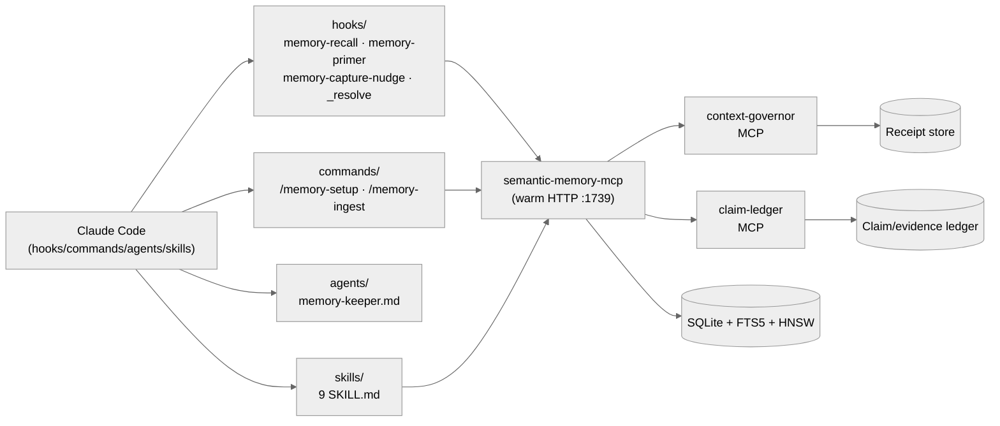

# semantic-memory for Claude Code

> **Tier 0 reference implementation.** Lifecycle hooks (SessionStart / UserPromptSubmit / PreCompact / Stop), a memory-keeper subagent, capture/curator/maintenance/sync skills, and manifest-declared commands — over `semantic-memory-mcp` (profile-based tool counts, run `generate-tool-surface-docs.py` for current) + `context-governor` (13 CLI commands) + `claim-ledger` (5 tools).
> Plugin marketplace path: `semantic-memory@semantic-memory-kit`.

[](#tier--scope)
[](#)
[](#)
[](https://crates.io/crates/semantic-memory-mcp)
[](https://crates.io/crates/context-governor)
[](https://crates.io/crates/claim-ledger)

See the [top-level README](../../README.md) for the full capability matrix, architecture overview, and Tier 0 vs Tier 1 distinction.

## Tier / scope

Tier 0 host plugin. This kit is the **reference implementation** that Tier 1 hosts (Cursor, Cline, Roo Code, Windsurf, Continue, OpenCode) reuse. The Tier 0 contract: real lifecycle hooks fire on SessionStart, UserPromptSubmit, PreCompact, and Stop, with deterministic fail-open behavior; capture is model-nudged (the model writes with judgment, not auto-dumped); and every claim of completion is backed by a receipt.

## Architecture



Hook paths: `claude/plugins/semantic-memory/hooks/`. Script paths: `claude/plugins/semantic-memory/scripts/`. Skill paths: `claude/plugins/semantic-memory/skills/`. All relative to repo root.

## Install

From the repo root:

```text
/plugin marketplace add RecursiveIntell/agent-memory-kits
/plugin install semantic-memory@semantic-memory-kit
/memory-setup
```

Restart Claude Code once so hooks load. `/memory-setup` installs the binary and allowlists tools.

## What you get

### Hooks (4)

`claude/plugins/semantic-memory/hooks/hooks.json` wires four lifecycle hooks. Every hook **fails open** — missing binary, timeout, or bad JSON exits 0 and never blocks the prompt.

| Hook | Event | What it does | Fail-open |
|---|---|---|---|
| `memory-primer.sh` | `SessionStart` (startup, resume, clear) | Injects project-scoped primer facts as `additionalContext` | yes — 12s timeout |
| `memory-recall.sh` | `UserPromptSubmit` | Queries warm HTTP `/search` (BM25 + vector + RRF), injects hits that clear `SM_RECALL_MINTOP=0.58` as `additionalContext` | yes — 12s timeout |
| `memory-capture-nudge.sh` | `PreCompact` and `Stop` | Reminds the model to save durable facts / decisions before the conversation ends or compacts | yes — 5s timeout |
| `_resolve.sh` | helper, not a hook event | Resolves the plugin's `${CLAUDE_PLUGIN_ROOT}` to the absolute path so siblings can find binaries | n/a |

### Scripts

`claude/plugins/semantic-memory/scripts/` includes MCP wrappers, doctor/benchmark helpers, ingestion, proof/evidence helpers, admin server launchers, and context-governor audit wrappers. Avoid hardcoded script counts here; the script directory is the source of truth.

- `context-governor-mcp.py` — MCP server entry for `context-governor` (4 `cg_*` tools)
- `claim-ledger-mcp.py` — MCP server entry for `claim-ledger` (5 `cl_*` tools)
- `context-governor-compact.py` — deterministic transcript compaction, writes receipt
- `doctor-all.py` — runs all kit doctors and writes a JSON receipt bundle
- `benchmark-retrieval.py` — quality benchmark over warm HTTP
- `benchmark-context-governor.py` — compaction latency / ratio benchmark
- `ingest_codebase.py` — language-agnostic repo ingester
- `evidence-workbench.py`, `proof-packet.py` — proof/evidence packet helpers
- `context-governor-audit.py` — context-governor audit wrapper
- `run-server.sh`, `run-server-admin.sh` — daily and admin semantic-memory launchers

### Commands (2)

- `/memory-setup` — install binary, allowlist tools, write rules (see `claude/plugins/semantic-memory/commands/memory-setup.md`)
- `/memory-ingest <path>` — run `ingest_codebase.py` on a repo path (see `claude/plugins/semantic-memory/commands/memory-ingest.md`)

### Agent (1)

- `memory-keeper.md` — subagent that audits memory health, runs the curator, and re-anchors stale facts

### Skills (9)

Each skill is `claude/plugins/semantic-memory/skills/<name>/SKILL.md`:

| Skill | Purpose |
|---|---|
| `memory-capture` | When and how to save durable facts and decisions |
| `memory-curator` | Reconcile duplicates, supersede stale facts, prune contradicted records |
| `memory-maintenance` | Vacuum, re-embed stale vectors, run `doctor-all` |
| `memory-sync` | Promote facts across namespaces; pair with `ingest_codebase.py` |
| `knowledge-graph-explorer` | Use `sm_topology`, `sm_communities`, `sm_factor_graph` for second-order discovery |
| `release-gate` | Run `cargo fmt --check`, `cargo clippy -- -D warnings`, `cargo test --workspace` and store receipts |
| `context-compaction` | Drive `context-governor-compact.py` before manual or auto compaction |
| `claim-provenance` | Back material assertions with `cl_run` / `cl_evidence` / `cl_verify` |
| `llm-output-parsing` | Use the `sm_parse_*` tools to handle think blocks, malformed JSON, trailing text |

### MCP tools exposed

The `semantic-memory-mcp` server exposes profile-based tool counts (lean/standard/full/admin). Run `python shared/scripts/generate-tool-surface-docs.py --out /tmp/tool-surface.json` for current counts. See the [top-level "The three MCP companions" section](../../README.md#the-three-mcp-companions) for the full breakdown. `context-governor` exposes 13 CLI commands, `claim-ledger` exposes 5.

## Receipts

- Top-level doctor: `shared/scripts/doctor-all.py --deep` (see [top-level Receipts section](../../README.md#receipts-and-benchmarks))
- Hook-specific debug log: `export SEMANTIC_MEMORY_HOOK_DEBUG=~/sm-hooks.log`
- Compaction receipts: `~/.local/share/context-governor/receipts/`
- Claim ledger: append-only JSONL at `~/.local/share/claim-ledger/ledger.jsonl` (verify with `cl_ledger_verify`)

This host also has a host-specific `doctor.py` script via `claude/plugins/semantic-memory/scripts/doctor-all.py`.

## Design principles

Claude Code is the reference impl, so its principles are the strictest:

- **Fail-open hooks.** Every hook exits 0 on error. A missing binary never blocks a prompt.
- **Nudged capture, not auto-dump.** The `memory-capture-nudge.sh` hook reminds the model at `PreCompact` and `Stop`; it never writes on its own.
- **Hook wiring is declarative.** All four hooks are listed in `claude/plugins/semantic-memory/hooks/hooks.json` — the source of truth.

These extend the [top-level Design principles](../../README.md#design-principles); they don't replace them.

## Troubleshooting

| Symptom | Fix |
|---|---|
| Hooks don't fire | Restart Claude Code or open `/hooks` once. Config reloads at session start. |
| `memory-recall.sh` silent | Check `SEMANTIC_MEMORY_HTTP_PORT=1739`; the warm server may not be up. The hook falls back to stdio MCP cold-spawn. |
| `memory-recall.sh` injects too much | Raise `SM_RECALL_MINTOP` from 0.58 to 0.65. |
| `/memory-setup` fails on `cargo install` | Re-run after `rustup update stable`. |
| Want to inspect hook payloads | `export SEMANTIC_MEMORY_HOOK_DEBUG=~/sm-hooks.log` and tail. |
