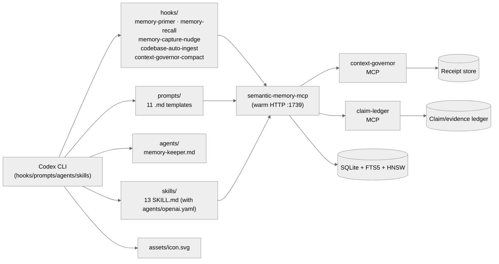

# semantic-memory for Codex CLI

> **Tier 0 reference implementation.** Session / prompt / PreCompact / Stop hooks, an automatic codebase-ingest hook, 11 prompts, 1 subagent, an icon asset, and script wrappers — over `semantic-memory-mcp` + `context-governor` + `claim-ledger`.
> Plugin marketplace path: `semantic-memory@semantic-memory-codex-kit`.

[](#tier--scope)
[](#)
[](#)
[](https://crates.io/crates/semantic-memory-mcp)
[](https://crates.io/crates/context-governor)
[](https://crates.io/crates/claim-ledger)

See the [top-level README](../../README.md) for the full capability matrix, architecture overview, and Tier 0 vs Tier 1 distinction.

## Tier / scope

Tier 0 host plugin. This kit is the **reference implementation** that Tier 1 hosts reuse, with two extensions Claude Code does not have: an **automatic codebase-ingest hook** that runs on `UserPromptSubmit`, and 11 `prompts/` templates (one per common memory operation) in addition to skills. Codex also uses warm HTTP port `1739` by default so it does not collide with Hermes/Claude sidecars on `1738`.

## Architecture



Hook paths: `codex/plugins/semantic-memory/hooks/`. Prompt paths: `codex/plugins/semantic-memory/prompts/`. Skill paths: `codex/plugins/semantic-memory/skills/`. All relative to repo root.

## Install

From the repo root:

```bash
git clone https://github.com/RecursiveIntell/agent-memory-kits
cd agent-memory-kits
codex plugin marketplace add ./codex
codex plugin add semantic-memory@semantic-memory-codex-kit
```

The Codex plugin installs the MCP server config, skills, prompts, warm recall hooks, automatic codebase-ingest hook, context-governor MCP, and claim-ledger MCP.

## What you get

### Hooks (5)

`codex/plugins/semantic-memory/hooks/hooks.json` wires five lifecycle hooks. All hooks **fail open** — missing binary, timeout, or bad JSON exits 0.

| Hook | Event | What it does | Fail-open |
|---|---|---|---|
| `memory-primer.py` | `SessionStart` (startup, resume, clear) | Injects project-scoped primer facts as `additionalContext` | yes — 12s timeout |
| `memory-recall.py` | `UserPromptSubmit` | Queries warm HTTP `/search`, injects hits that clear `SM_RECALL_MINTOP=0.58` | yes — 12s timeout |
| `codebase-auto-ingest.py` | `UserPromptSubmit` | Detects a new repo in the working tree and queues a `--dedupe` ingest | yes — 5s timeout |
| `memory-capture-nudge.py` | `PreCompact` and `Stop` | Reminds the model to save durable facts / decisions before the conversation ends or compacts | yes — 5s timeout |
| `context-governor-compact.py` | `PreCompact` (manual, auto) | Runs deterministic compaction and writes a receipt | yes — 30s timeout |

### Prompts (11)

`codex/plugins/semantic-memory/prompts/`:

| Prompt | Purpose |
|---|---|
| `memory-search.md` | Hybrid BM25 + vector search with cosine score + relative gate |
| `memory-capture.md` | Save a durable fact with namespace, source, and confidence |
| `memory-curator.md` | Reconcile duplicates, supersede stale, prune contradicted |
| `memory-doctor.md` | Run `doctor-all.py --deep` and surface the receipt |
| `memory-graph.md` | Use `sm_topology` / `sm_communities` / `sm_factor_graph` |
| `memory-ingest.md` | Run `ingest_codebase.py` on a path with `--dedupe` |
| `memory-sync.md` | Promote facts across namespaces |
| `memory-conversation.md` | Save a transcript as a search-recoverable session |
| `context-compact.md` | Drive `context-governor-compact.py` before compaction |
| `claim-provenance.md` | Back material assertions with `cl_run` / `cl_evidence` |
| `llm-parse.md` | Use the `sm_parse_*` tools for LLM output parsing |

### Agent (1)

- `memory-keeper.md` — subagent that audits memory health, runs the curator, and re-anchors stale facts

### Skills (13)

`codex/plugins/semantic-memory/skills/<name>/SKILL.md` (each paired with `agents/openai.yaml`):

`claim-provenance` · `context-compaction` · `knowledge-graph-explorer` · `llm-output-parsing` · `memory-capture` · `memory-conversation-log` · `memory-curator` · `memory-ingest-codebase` · `memory-keeper` · `memory-maintenance` · `memory-setup-doctor` · `memory-subagent-workflow` · `memory-sync` · `release-gate` · `semantic-memory`

(15 SKILL.md dirs; the count includes the `semantic-memory` meta-skill and the `memory-keeper` skill in addition to the agent file.)

### Scripts

`codex/plugins/semantic-memory/scripts/` includes MCP wrappers, doctor/benchmark helpers, retrieval audits, installer helpers, ingestion, proof/evidence helpers, admin server launchers, and context-governor audit wrappers. Avoid hardcoded script counts here; the script directory is the source of truth.

- `context-governor-mcp.py` — MCP server entry for `context-governor`
- `claim-ledger-mcp.py` — MCP server entry for `claim-ledger`
- `context-governor-compact.py` — deterministic transcript compaction
- `doctor.py`, `doctor-all.py` — kit doctor and rollup
- `benchmark-retrieval.py`, `benchmark_memory_quality.py` — retrieval quality
- `benchmark-context-governor.py` — compaction benchmarks
- `ingest_codebase.py` — language-agnostic repo ingester
- `audit_memory.py`, `eval_recall.py` — quality audits
- `install-global-config.py`, `install-global-hooks.sh`, `install-project-hooks.sh` — installer scripts
- `evidence-workbench.py`, `proof-packet.py` — proof/evidence packet helpers
- `context-governor-audit.py` — context-governor audit wrapper
- `run-server.sh`, `run-server-admin.sh` — daily and admin semantic-memory launchers

### Asset (1)

- `assets/icon.svg` — Codex marketplace icon for the plugin

### MCP tools exposed

`semantic-memory-mcp` tool counts vary by profile (lean/standard/full/admin). Run `python shared/scripts/generate-tool-surface-docs.py --out /tmp/tool-surface.json` for current counts. `context-governor` exposes 13 CLI commands. `claim-ledger` exposes 5. See the [top-level "The three MCP companions" section](../../README.md#the-three-mcp-companions).

## Receipts

- Top-level doctor: `shared/scripts/doctor-all.py --deep`
- Host-specific doctor: `codex/plugins/semantic-memory/scripts/doctor-all.py`
- Hook debug log: `export SEMANTIC_MEMORY_HOOK_DEBUG=~/sm-hooks.log`
- Compaction receipts: `~/.local/share/context-governor/receipts/`
- Claim ledger: append-only JSONL at `~/.local/share/claim-ledger/ledger.jsonl`
- Quality audits: `codex/plugins/semantic-memory/scripts/audit_memory.py` and `eval_recall.py`

## Design principles

Codex is the reference impl, with two extensions over Claude Code:

- **Automatic codebase ingest.** The `codebase-auto-ingest.py` hook detects a new working tree and queues `--dedupe` ingest on `UserPromptSubmit`. This is a convenience, not a replacement for explicit `/memory-ingest`.
- **Prompt templates per operation.** The `prompts/` directory gives a one-shot template for each of the 11 common memory operations; the model picks the right one rather than constructing a free-form tool call.

These extend the [top-level Design principles](../../README.md#design-principles); they don't replace them.

## Troubleshooting

| Symptom | Fix |
|---|---|
| Hooks don't fire | Restart Codex; hook config reloads at session start. |
| `memory-recall.py` silent | Confirm `SEMANTIC_MEMORY_HTTP_PORT=1739` and that the warm server is reachable. The hook falls back to stdio MCP cold-spawn. |
| `codebase-auto-ingest.py` no-ops | It's gated on a 5s timeout; if `ingest_codebase.py` would take longer, run it manually with `/memory-ingest`. |
| Warm port conflict with Hermes/Claude | Codex uses `1739` by default. Hermes/Claude use `1738`. Set `SEMANTIC_MEMORY_HTTP_PORT=0` to disable the warm server on a specific host. |
| Want to inspect hook payloads | `export SEMANTIC_MEMORY_HOOK_DEBUG=~/sm-hooks.log` and tail. |
