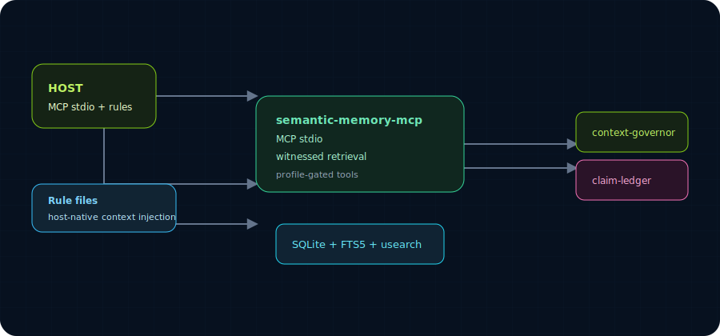

# semantic-memory for Continue

> **Tier 1 host plugin.** MCP-only integration; rule/context injection for behavioral guidance.

[](#capability-boundary)
[](#)
[](#)

See [top-level README](../README.md) for the full capability matrix and architecture overview.

This is the Continue MCP setup kit for semantic-memory-mcp.

Capability boundary:
- Works: exposes the `sm_*` semantic-memory MCP tools to Continue once the MCP config is registered.
- Works: local-first memory storage, hybrid search, graph tools, provenance, supersession, claims, and manual/codebase-ingest workflows.
- Works: context-injection via host rule/instruction files. The setup kit can install a semantic-memory rule that tells the agent to retrieve memory through MCP, or through the shared context command when shell execution is available.
- Boundary: this is rule/instruction based for this host, not a guaranteed pre-prompt hook unless the host exposes a stable hook API.

> **This is a Tier 1 kit.** Tier 1 hosts expose the MCP server to the agent and install host-native rule/instruction files that tell the agent to retrieve memory through MCP and preserve receipts. No transcript/prompt lifecycle hook is claimed.

## Install

From the repository root:

```bash
continue/scripts/setup.sh
```

Copy the printed `mcpServers.semantic-memory` snippet into Continue MCP configuration.

## Verify

```bash
continue/scripts/doctor.py
```

Expected:
- `config.json.example` parses as JSON.
- `semantic-memory-mcp` binary is found.
- memory dir exists.
- MCP `tools/list` exposes `sm_search`, `sm_add_fact`, `sm_stats`, and `sm_supersede_fact`.

## Use inside Continue

Ask Continue to call the semantic-memory MCP tools, for example:

```text
Search semantic memory for facts about this repository before changing code.
```

or:

```text
Save this decision to semantic memory with namespace code:<repo-name> and source Continue.
```

## Notes

If the warm HTTP health check warns, MCP stdio can still work. Warm HTTP is mainly for hook-based hosts; MCP tool use does not require it.


## Context injection

Install a workspace rule into a project:

```bash
shared/scripts/install-context-rules.py continue --scope workspace --workspace /path/to/project
```

Install a global rule where the host has a documented global-rule location:

```bash
shared/scripts/install-context-rules.py continue --scope global
```

The installed rule points at:

```bash
shared/scripts/semantic-memory-context.py --prompt "$USER_TASK"
```

That command queries the warm HTTP server first (`SEMANTIC_MEMORY_HTTP_PORT`, default `1739`) and falls back to stdio MCP. Returned entries are explicitly marked as recall, not ground truth.


## Context compaction / receipts

This kit also includes Context Governor as a companion MCP server and rule layer.

- MCP server: `shared/scripts/context-governor-mcp.py`
- Receipt-backed compact command: `shared/scripts/context-governor-compact.py`
- Rule text: `shared/rules/context-governor.md`

Use it when a Continue session is long, a handoff is needed, or context is about to be compacted. It preserves high-risk context and stores exact fallback receipts that can be searched and expanded later.

Boundary: for hosts without a verified pre-compact hook, this is rule/command/MCP assisted. It does not claim automatic transcript capture unless the host exposes transcript messages to an extension/hook API.


## Quick install

Print config snippets only:

```bash
continue/scripts/setup.sh
```

Write project-local rule/config files:

```bash
continue/scripts/setup.sh --write-project /path/to/project
```

Write safe user/global rule files where this host supports them:

```bash
continue/scripts/setup.sh --write-user
```

Dry run before writing:

```bash
continue/scripts/setup.sh --dry-run --write-project /path/to/project
```

Verify:

```bash
continue/scripts/doctor.py
shared/scripts/doctor-all.py --deep
```

## Architecture



## Design principles

- **Rule-injection, not hook-injection.** Tier 1 hosts install host-native rule files that tell the agent to retrieve memory through MCP; no pre-prompt hook is claimed.
- **MCP stdio is the only lifecycle path.** The host starts `semantic-memory-mcp` when it loads the MCP config; no warm HTTP sidecar is started by this host.

These extend the [top-level Design principles](../README.md#design-principles); they don't replace them.

## Troubleshooting

| Symptom | Fix |
|---|---|
| `config.json.example` not parseable | `python3 -m json.tool continue/config.json.example` — should print valid JSON. |
| MCP not loading in Continue | Restart Continue after writing the MCP config; check Continue's MCP logs. |
| Rule not auto-applying | Verify the rule path with `continue/scripts/setup.sh --write-user` produced the expected rule file. |
