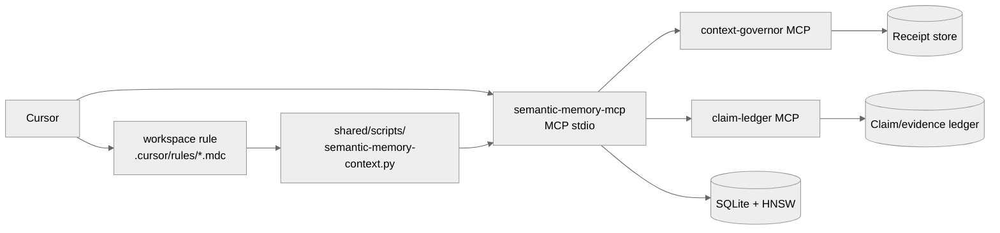

# semantic-memory for Cursor

> **Tier 1 host plugin.** MCP-only integration; rule/context injection for behavioral guidance.

[](#capability-boundary)
[](#)
[](#)

See [top-level README](../../README.md) for the full capability matrix and architecture overview.

This is the Cursor MCP setup kit for semantic-memory-mcp.

Capability boundary:
- Works: Cursor can call the `sm_*` semantic-memory MCP tools from this server.
- Works: local-first memory storage, hybrid search, graph tools, provenance, supersession, claims, and codebase-ingest scripts.
- Not claimed yet: automatic pre-prompt recall. This package does not assume Cursor exposes a stable hook that can inject recall context before every model call.

> **This is a Tier 1 kit.** Tier 1 hosts expose the MCP server to the agent and install host-native rule/instruction files that tell the agent to retrieve memory through MCP and preserve receipts. No transcript/prompt lifecycle hook is claimed.

## Install

From the repository root:

```bash
cursor/scripts/setup.sh
```

To write a project-local Cursor MCP config:

```bash
cursor/scripts/setup.sh --write-project
```

That creates `.cursor/mcp.json` with this server:

```json
{
  "mcpServers": {
    "semantic-memory": {
      "command": "/absolute/path/to/semantic-memory-agent-kits/cursor/scripts/run-server.sh",
      "env": {
        "SEMANTIC_MEMORY_DIR": "$HOME/.local/share/semantic-memory",
        "SEMANTIC_MEMORY_TOOL_PROFILE": "lean",
        "SEMANTIC_MEMORY_HTTP_PORT": "1739"
      }
    }
  }
}
```

For a global install, copy the same `mcpServers.semantic-memory` entry into Cursor's global MCP settings as documented by Cursor.

## Verify

```bash
cursor/scripts/doctor.py
```

Expected:
- `mcp.json.example` parses as JSON.
- `semantic-memory-mcp` binary is found.
- memory dir exists.
- MCP `tools/list` exposes `sm_search`, `sm_add_fact`, `sm_stats`, and `sm_supersede_fact`.

## Use inside Cursor

Ask Cursor to use the semantic-memory MCP tools, for example:

```text
Search semantic memory for facts about this repository before changing code.
```

or:

```text
Save this decision to semantic memory with namespace code:<repo-name> and source Cursor.
```

## Notes

If the warm HTTP health check warns, MCP stdio can still work. Warm HTTP is an optimization for hook-based hosts; Cursor MCP tool use does not require it.


## Context injection

Install a workspace rule into a project:

```bash
shared/scripts/install-context-rules.py cursor --scope workspace --workspace /path/to/project
```

Cursor global User Rules are UI-managed, so this kit installs a project `.cursor/rules/*.mdc` rule instead of claiming a global file path.

The installed rule points at:

```bash
shared/scripts/semantic-memory-context.py --prompt "$USER_TASK"
```

That command queries the warm HTTP server first (`SEMANTIC_MEMORY_HTTP_PORT`, default `1739`) and falls back to stdio MCP. Returned entries are explicitly marked as recall, not ground truth.


## Context compaction / receipts

This kit also includes Context Governor as a companion MCP server and rule layer.

- MCP server: `shared/scripts/context-governor-mcp.py`
- Receipt-backed compact command: `shared/scripts/context-governor-compact.py`
- Rule text: `shared/rules/context-governor.md`

Use it when a Cursor session is long, a handoff is needed, or context is about to be compacted. It preserves high-risk context and stores exact fallback receipts that can be searched and expanded later.

Boundary: for hosts without a verified pre-compact hook, this is rule/command/MCP assisted. It does not claim automatic transcript capture unless the host exposes transcript messages to an extension/hook API.


## Quick install

Print config snippets only:

```bash
cursor/scripts/setup.sh
```

Write project-local rule/config files:

```bash
cursor/scripts/setup.sh --write-project /path/to/project
```

Write safe user/global rule files where this host supports them:

```bash
cursor/scripts/setup.sh --write-user
```

Dry run before writing:

```bash
cursor/scripts/setup.sh --dry-run --write-project /path/to/project
```

Verify:

```bash
cursor/scripts/doctor.py
shared/scripts/doctor-all.py --deep
```

## Architecture



## Design principles

- **Rule-injection, not hook-injection.** Tier 1 hosts install host-native rule files that tell the agent to retrieve memory through MCP; no pre-prompt hook is claimed.
- **MCP stdio is the only lifecycle path.** The host starts `semantic-memory-mcp` when it loads the MCP config; no warm HTTP sidecar is started by this host.

These extend the [top-level Design principles](../../README.md#design-principles); they don't replace them.

## Troubleshooting

| Symptom | Fix |
|---|---|
| `mcp.json.example` not parseable | `python3 -m json.tool cursor/mcp.json.example` — should print valid JSON. |
| MCP not loading in Cursor | Restart Cursor after writing the MCP config; check Cursor's MCP logs. |
| Rule not auto-applying | Verify the rule path with `cursor/scripts/setup.sh --write-project /path/to/project` produces `.cursor/rules/*.mdc`. |
