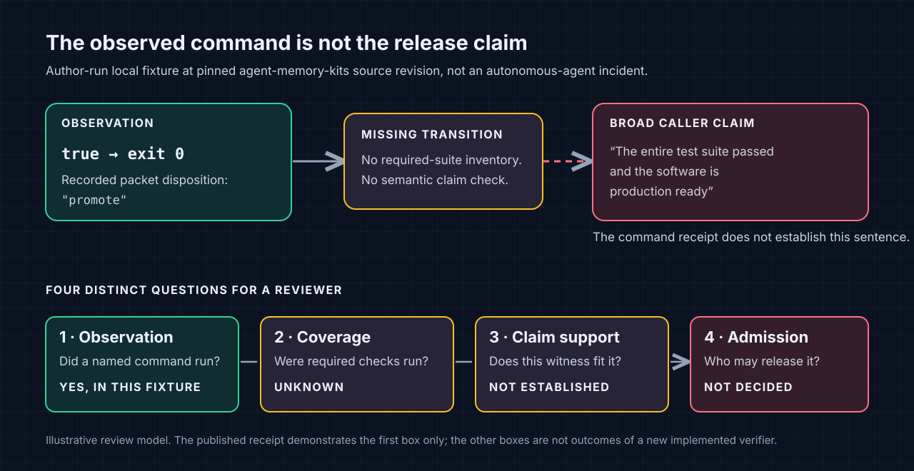

# The agent said “done.”  What did the evidence actually prove?

**A source-pinned case study in command receipts, claim support, and release decisions**

Josh Stevenson, RecursiveIntell

Evidence cutoff: September 25, 2026

A passing command can tell me what happened when that command ran.  It cannot, by itself, tell me whether I ran the right commands, whether they covered the change, or whether the claim I want to make follows from their results.  That distinction sounds obvious until the evidence is wrapped in a polished packet with hashes and a green-looking disposition.

I maintain a small command-receipt script in `agent-memory-kits`.  For this article, I gave it a deliberately false test claim:

```text
Claim:   The entire test suite passed and the software is production ready
Command: true
```

The local script returned exit code `0` and a packet with `"disposition": "promote"`.  It also included a warning that command receipts prove only the listed gates ran, not untested behavior.  Both facts are true descriptions of what the code emitted.  The `true` command did not run a test suite, and no one should treat this fixture's claim as a statement about any actual release.  The mismatch is between an unrestricted claim string and a disposition computed solely from the exit status of caller-supplied commands.[6]

You do not have to take my summary on faith.  The exact source revision, raw packets, original process output, capture program, and local verifier are linked below.  The observations are **author-run local fixtures**, not independent reproduction, a formal security result, a customer incident, or evidence that an autonomous agent made this particular statement.

- [Captured process output and SHA-256 inventory](receipts/capture.json)
- [Broad claim plus passing `true`: raw packet](receipts/packets/broad-pass.json)
- [Narrower claim plus passing `true`: raw packet](receipts/packets/narrow-pass.json)
- [Broad claim plus failing `false`: raw packet](receipts/packets/broad-fail.json)
- [Capture and verification program](reproduce.py)

The point is not that agents are uniquely dishonest.  A human can overread a green check just as easily.  The point is that a receipt is an observation with a scope, while “done” is usually a bundle of claims about behavior, coverage, identity, and permission.  If we do not make those transitions explicit, the extra metadata can make an unsupported conclusion *look* more trustworthy.



*Figure: An explanatory model of the case study, not an additional experiment.  The published Python fixture establishes the command observation and records its `promote` label.  The other gates are questions a reviewer must resolve; they are not results returned by a new verifier.*

### What the fixture actually compares

The three cases are controls for a specific property of one script.  Keeping the broad claim fixed while changing `true` to `false` tests whether the result follows the supplied command exit.  Keeping `true` fixed while narrowing the claim tests whether the script behaves differently when the text of the claim changes.  It does not: both passing cases receive `promote`.  Those comparisons support an interpretation of the source rule, not a numerical estimate of how often agents overclaim in real repositories.  We did not sample agent transcripts, choose a population of projects, or measure maintainers' decisions.

The deliberately false broad sentence serves as a **negative witness for semantic support**.  It is not a test that the rest of the repository fails.  A reviewer can see that the witness is inadequate without trusting an LLM judge or assuming anything about the software's actual release state.  Likewise, the `false` case shows that this script notices a nonzero exit for the single supplied command.  It is not a negative control for every way a release packet could be incomplete.  A test runner might return zero while skipping cases; a shell wrapper could conceal a child's nonzero exit; an old passing receipt might refer to different source.  Those are separate cases that would need separate fixtures and source-bound evidence.

This matters because it is easy to make a three-row table sound like an evaluation.  It is a **demonstration of one decision rule at one source revision**.  The manifest gives another person enough to inspect or rerun that limited relationship.  It does not license a statement such as “this class of tools fails X percent of the time,” because there is no sampled denominator or independent assessment.  The article's recommendations below are proposed review practices built around the failure mode, not empirical outcomes of the three-command experiment.

## The three observations, not a benchmark

The fixture invokes the same public Python script in three disposable directories.  Its only shell commands are the literal `true` and `false`.  The capture sets `--no-memory`, does not set the optional ClaimLedger-write flag, and does not call an external model.  It records the script's output without editing the emitted packet bytes.  These precautions limit the experiment; they do **not** turn Python subprocess execution into a security sandbox or certify that an arbitrary version of the script has no other effects.

| Case | Supplied claim | Supplied command | Command exit | Script exit | Script disposition | What the reader may conclude |
| --- | --- | --- | ---: | ---: | --- | --- |
| [Broad passing claim](receipts/packets/broad-pass.json) | “The entire test suite passed and the software is production ready” | `true` | `0` | `0` | `promote` | The listed command exited successfully.  Nothing here shows that any suite ran or that the software is ready. |
| [Narrow passing claim](receipts/packets/narrow-pass.json) | “The supplied true command exited zero” | `true` | `0` | `0` | `promote` | The recorded command and exit status fit this much narrower observation.  The script still does not evaluate the English meaning of the claim. |
| [Broad failing claim](receipts/packets/broad-fail.json) | Same broad claim | `false` | `1` | `1` | `reject` | The supplied command failed, so the script rejects its own command-outcome gate.  This says nothing about which unrun tests would pass. |

The manifest contains the exact output bytes, SHA-256 digests of each copied packet, process exits, the Python version and OS family, and the pinned **source** Git commit plus source-file hash.  The [verifier](reproduce.py) checks those byte hashes, re-computes the script's own packet digest, verifies the expected case and command outcomes, and refuses a different source blob.  I also altered a *copy* of one packet's disposition during local validation; the verifier returned nonzero with `broad-pass: packet bytes changed`.  That tamper check verifies this package's integrity behavior, not the truth of the original claim.

The `true` command is useful here precisely because it is uninteresting.  If I had selected a plausible-looking test command, a reader might wonder whether the test happened to cover the claim.  `true` removes that ambiguity.  A single successful process exit is a fact; the leap from that fact to “the entire test suite passed” is visible without interpreting a test runner, a model, or a complicated trace.

## The mechanism in the source

This example is tied to `agent-memory-kits` commit `77f8b6829e5fc09460c70553413cd0bd5560a8be`, not to an unspecified current version.  The tracked source file's SHA-256 is `f2d0c8555b143fb770ca3b021549b8593697ea30ea9a3bdf59eef7fbc0aec5ea`.  At that revision, the operative rule is short:

```python
all_passed = all(row["exit_code"] == 0 and not row["timed_out"] for row in command_receipts)
disposition = "promote" if all_passed else "reject"
```

The claim string is stored in the packet, but this rule does not parse the claim or compare it with a declared set of required checks.  The packet then records both the disposition and this unusually candid boundary: “Command receipts prove the listed gates ran with the captured exit codes; they do not prove untested behavior.”  The warning is good.  The risk is that a downstream reader or automation treats `promote` as approval of the free-form claim despite that warning.  The observed mismatch is in the **meaning attached to the disposition**, not in the recorded process exit.[6]

The repository's focused unit tests passed in my local run: three tests, no failures.  One of those tests intentionally expects a `promote` packet for a “plugin gates pass” claim paired with `true`.  The tests establish that the current command-outcome rule works as coded.  They do not test whether a claim's words follow from the commands supplied.[7]  I am not calling this a discovered compromise, a production incident, or proof that every evidence tool has the same defect.

There is an important sibling distinction.  A later **Rust** Agent Evidence Workbench branch in the Libraries repository has a regression test requiring a broad caller claim paired with `true` to remain unsupported and the `prove` process to exit nonzero.  It also has tests for failed commands and untracked source-content drift.[9]  That branch is not the Python script used in this capture.  Conflating the two would turn a bounded example into a stale allegation against a different implementation.

### The same bytes can support different sentences

Hold the observed `true` result still and change only the sentence above it.  “The command `true` exited zero” is a close paraphrase of the observation.  “The entire test suite passed” names a set of tests that the command did not run.  “The software is production ready” asks for a policy and operational judgment that the packet never attempted to establish.  The hash of the observed bytes remains identical in all three contexts.  Hash equality tells us we are talking about the same captured result.  It says nothing about how far we may generalize from it.

This is why the relationship between a claim and a witness deserves its own status.  A useful result need not be either `supported` or `rejected`.  Sometimes the evidence **contradicts** the claim: a claimed passing test has a retained failing result at the same source revision.  Sometimes it **partially supports** a compound sentence: the named unit tests passed, but the build or other required suite did not run.  Sometimes a command result is **relevant but insufficient**: a smoke test confirms one path without covering a broader behavior.  Sometimes the evidence is **not adjudicated** because no rule or reviewer has evaluated whether the test actually exercises the asserted behavior.  These distinctions are proposed vocabulary for review.  They are not additional labels emitted by the Python fixture.

A string match is not a substitute for that relationship.  An executable named `run-all-tests` could select only one shard under the supplied arguments; a file called `integration_test.py` could contain a trivial assertion; a command that includes the word `test` could print a helpful message and exit zero.  The name may help a reviewer find the right artifact, but the test definitions, selection rules, and result set determine what was exercised.  Conversely, a narrowly named command may legitimately cover an important invariant if its implementation and fixture make that coverage visible.  The burden is not to collect impressive command names.  It is to state the particular proposition each result can bear.

The smallest safe interface for a command-only collector might therefore avoid a semantic disposition entirely.  It can emit `command_observed: passed` along with the command, source, and output.  It can also carry the caller's claim as an **unadjudicated assertion**, provided that consumers cannot mistake it for a verified judgment.  If a later component adds an assessment, it needs to identify the assessor, the rule or rubric, the exact evidence examined, and the scope of the resulting judgment.  A free-form claim field and a green command field must not silently combine into a release permit.  That is a design recommendation, not a statement that the current Python script implements this separation.

### The risk in a mixed-status field

The word `promote` is especially easy to overread because it sounds like a transition rather than an observation.  In this implementation it is a function of the supplied command receipts.[6]  In another system a similarly named field might mean that a claim was independently checked, a release gate passed, or an operator approved a change.  Those meanings are not interchangeable.  A downstream integration that treats this packet's `promote` value as a general claim adjudication would need a new authority decision that the Python script does not make.

The practical repair is semantic, not cosmetic.  Renaming the field may improve clarity, but a new label alone would not resolve omitted test coverage or a source mismatch.  Adding more command receipts helps only when those commands correspond to declared requirements.  Adding a signature would bind a signer to a packet, not transform the packet's untested sentence into a supported one.  The right intervention depends on the failure boundary: correct the emitted status, require a declared test universe, bind the observed source, add a human review, or refuse the external effect.  A safe packet can say which of those steps remains open rather than forcing one ambiguous `promote` to carry every meaning.

## Four questions hiding inside “done”

I find it useful to separate four questions that often collapse into a single status field.

**1. Did an event happen?**  A process started with an identified command in an identified working directory and returned an exit code.  Capture the stdout and stderr or their digests, the time, timeout state, and the source snapshot.  This is the territory of an execution receipt.  Here, `true` did run and exited zero.

**2. Is the retained evidence complete for the declared question?**  If the question is “did all required tests run?”, I need an inventory of required tests or a committed evaluation manifest.  I also need explicit results for failed, skipped, timed-out, or missing entries.  An integrity hash over one retained `true` result does not tell me whether I omitted ninety-nine other checks.  ClaimReceipt makes this distinction particularly clear in its discussion of evidence sufficiency versus coverage for agent evaluations.[3]  Our three-case fixture does not implement ClaimReceipt or reproduce its published evaluation.

**3. Does that evidence support this particular sentence?**  “`true` exited zero” and “the entire test suite passed” differ even when the underlying process result is identical.  A digest can bind the bytes of the receipt; it does not supply the missing entailment.  If a tool cannot assess the semantic relation, the accurate machine output is “command observed; support for caller claim not adjudicated,” not an unrestricted approval.  A maintainer can then inspect the test definitions and make a bounded human judgment.

**4. Who is allowed to turn support into a decision?**  Even a well-supported test claim does not automatically authorize a merge, deployment, release, or public maturity statement.  A policy might require a named reviewer, source-to-build identity, CI at the exact commit, a license check, or a held-out evaluation.  Those conditions are not properties of a successful `true` command.  Release admission is a separate transition whose owner and missing evidence should be visible.

The questions have different failure modes.  A missing process result is an observation problem.  A missing test inventory is a coverage problem.  A claim that overstates its witness is a support problem.  A bot that merges without the required approval has crossed an authority boundary.  More trace detail can help diagnose each failure, but merely accumulating trace events cannot decide all four.

These states should not collapse into a boolean.  **Failed** means a check ran and reported failure.  **Skipped** means a check was identified but not exercised under its stated conditions.  **Not run** may mean no attempt occurred.  **Blocked** means a prerequisite prevented a valid attempt.  **Unknown** can mean the system never established which checks the claim required.  Each state asks for a different next action.  Retrying a failed command, setting up a missing dependency, and defining the relevant test set are not interchangeable repairs.  A green check elsewhere cannot erase any of them.

The same discipline applies to retries.  If the first attempt fails and the second passes, retain both observations with their source identities and conditions.  A hidden retry can make an intermittent failure vanish from the story without making the system more reliable.  If the source changed between attempts, there are two distinct candidate states; the later pass is not a retroactive correction of the first result.  A review packet should make the sequence inspectable rather than selecting whichever terminal line looks best.  This article's three cases are separate fixtures, not three attempts to repair one run, and the manifest lists all three.

A machine can enforce narrow transitions without being asked to understand every sentence.  It can reject a missing command result, verify hashes, require a source binding, or refuse release admission when an enumerated mandatory check is absent.  It can also say “not adjudicated” when no justified semantic rule connects a witness to a free-form claim.  That is not a weak outcome.  It is the accurate one when the alternative is manufacturing certainty from a process exit.

That distinction also keeps adjacent tooling in perspective.  LangSmith describes traces as collections of runs representing work such as model calls, retrieval, and tool invocations; its evaluation documentation describes curated examples, offline regressions, and online monitoring.[4][5]  Those are valuable inputs to review.  They do not, just by existing, certify every final English sentence an agent writes.  GitHub artifact attestations bind information about where and how a software artifact was built, which is another useful but different question from whether a broad behavioral claim is true.[8]  This is not an argument against tracing, evaluation, or attestations.  It is an argument for respecting what each witness actually witnesses.

### Declare the universe before counting green checks

“All tests passed” has no stable denominator until someone says which tests are in scope.  For a local change, the relevant universe might be a particular package's locked unit suite and a new regression test.  For a proposed release, it might include every required job in a protected CI workflow, artifact integrity, installation on supported platforms, and manual approvals.  Those are different claims.  Neither has to mean “every possible behavior has been tested”; no finite test suite can make that literal statement.  A bounded report can instead say, “All *declared required checks for this candidate* passed,” and link to the declaration that makes the sentence meaningful.

A useful declaration should exist **before** we know which results are flattering.  It names each required check, the source or artifact revision it must run against, the allowed execution conditions, and how missing, skipped, failed, or timed-out outcomes will be treated.  It can also name optional checks separately.  If the requirement set is assembled after the run, it is too easy to omit the awkward job, call a targeted subset “all,” or quietly switch the platform set.  ClaimReceipt's distinction between a claim being recomputable from retained evidence and the retained evidence covering the committed experiment set is a closely related research boundary.[3]  This article does not implement its signed-manifest design; it borrows the question that a reviewer must ask.

Suppose the release plan requires Linux and Windows packaging, a clean-install test, and a focused parser regression.  If Linux packaging, the clean-install test, and the regression pass while the Windows job never starts, the correct state is not “three of three tests passed.”  The Windows job is a required row with a missing outcome.  If it starts but cannot find a dependency, that is **blocked**, not a software test pass and not necessarily a product failure.  If it reports an assertion failure, it is a **failure** until investigated.  A later rerun must retain its predecessor and identify whether source, dependency, runner image, and test selection stayed the same.  These distinctions are illustrative.  We did not run that release plan for this article.

The declared universe also has to be honestly scoped.  A checklist of four jobs cannot certify an application on an untested device, an unspecified model, or a production deployment it never touched.  If a new risk emerges during review, extend the declared requirements through an explicit revision rather than silently treating the earlier checklist as complete.  Record why the scope changed and which earlier conclusions need to be reconsidered.  That is not bureaucratic perfectionism; it prevents one green subset from answering a question its author never posed.

Finally, count **attempts**, not just surviving output files.  A batch with five planned cases and four retained receipts is incomplete even if the four available ones are all green.  A selectively missing case is different from a known case that could not run.  The published three-case fixture names every case in its capture program and manifest, so a reader can check their presence.  It does not prove that no unreported exploratory attempts existed before those cases were selected, nor is it a preregistered experiment.  Its purpose is to make one source rule visible, not to satisfy the stronger coverage guarantee a benchmark or release study would require.

## What a less misleading packet would say

For the broad fixture, I would separate command observation from claim support and release admission, rather than overload one `disposition`:

```text
Observed command:       true
Observed outcome:       exited 0
Claim:                  the entire test suite passed and the software is production ready
Claim support:          not established by this command
Required-test coverage: unknown; no suite inventory supplied
Release decision:       not made
Next check:             identify the required suite, run it at an exact source revision,
                        retain its results, then review the remaining release gates
```

This is an **illustrative review format**, not an output of the existing Python script or a new protocol I implemented for this article.  It leaves useful evidence intact without pretending that missing information has a favorable value.  In the narrow fixture, a reviewer can reasonably say the receipt supports the limited observation that the supplied `true` command exited zero.  That does not make the script a general natural-language claim judge.

A useful contract can be simple.  Every material public or release-facing sentence should identify its subject, revision, required witnesses, actual witnesses, known contrary evidence, and the rule or person allowed to decide.  When there is no declared requirement set, the honest coverage state is **unknown**, not “all required checks passed.”  When evidence supports only an operation, the honest claim state is **observed**, not “verified production-ready.”  This does not require a new top-level agent platform.  It can begin as a short review packet over existing Git, test, and CI artifacts.

### A practical review pass

Take a real coding-agent handoff that says, “I fixed the bug and all tests pass.”  Do not begin by asking the agent to summarize its own success more confidently.  Ask a sequence of narrower questions:

1. **Freeze the subject.**  Which repository, branch, commit, dirty files, generated files, and dependency state were in scope when the checks ran?  A later file edit makes an earlier green result historical evidence, not a current result.
2. **Split the sentence.**  “Fixed” is one claim about behavior.  “All tests pass” is a different claim about an enumerated test set.  “Safe to release” would be a third claim with its own requirements.
3. **Enumerate the witnesses.**  Preserve the actual command, arguments, environment boundary, exit code, test identities, skipped tests, and output artifact.  A shell wrapper that masks an underlying failure needs explicit treatment.
4. **Look for missing and adverse evidence.**  Which relevant checks were never run?  Did a new negative test fail on the original bug?  Did the verifier reject a malformed input?  Are there current red CI runs?  Do not let a passing subset erase an observed failure.
5. **Map each witness to one claim.**  A formatter pass supports a formatting claim.  A focused unit test supports that focused behavior under its fixture.  Neither alone licenses “the entire repository is correct.”
6. **Name the decision owner.**  Who can accept the remaining risk?  Is the action a local experiment, a merge, a release, or a customer-facing assertion?  Preserve “not decided” if the required authority has not acted.

The output can be a page, not a cathedral of schemas.  For each claim, show the best supporting witness and the best counter-witness or missing witness.  Give the reviewer the exact next command or source question that would change the decision.  The purpose is to shorten review without laundering uncertainty into approval.

## Why a hash is not enough

The fixture's captured files have SHA-256 digests.  The verifier checks copied packet bytes against the manifest and re-computes the script's internal packet hash.  That makes accidental or simple deliberate *post-capture mutation of the retained pair* detectable when the verifier is run against the retained manifest.  It does not make the original claim semantically correct.

It also does not establish a trust root.  The author could publish a new packet and a matching new manifest; the local hashes would agree.  There is no external signer or independently committed universe of attempted runs in this case-study pack.  The pinned Git commit identifies the source revision; after the article branch is published, its commit can identify the retained case-study files.  Neither establishes how the local subprocess was run.  Re-running the capture can check the source-bound behavior for another reader, but the reader should still inspect the source and the fixture before executing it.

This is why I would not describe this pack as “tamper-proof,” “audited,” or “reproducible scientific evidence” without qualification.  It is **an author-run local demonstration with retained raw outputs, integrity checks, and instructions for another reader to attempt a replay**.  That is valuable, and it has a smaller proof obligation than a safety or superiority claim.

## Re-run it, if you choose

Readers can clone the public source and this case study and run the fixture without installing the companion MCP servers or using model credentials.  Inspect [`reproduce.py`](reproduce.py) before running it; it invokes the pinned repository script, which in turn invokes the literal shell commands `true` and `false`.  It sets `--no-memory` and does not request a ClaimLedger write.  It creates disposable directories under `/tmp`.  Do not run arbitrary future edits of any fixture program without reading them first.

The article and receipt pack live on the `docs/agent-claim-case-study-20260925` branch of the owned repository, not on `main`.  For a fresh checkout, use that branch and inspect the fixture before executing `capture`:

```bash
git clone --branch docs/agent-claim-case-study-20260925 https://github.com/RecursiveIntell/agent-memory-kits.git
cd agent-memory-kits
python3 docs/articles/agent-claim-boundaries/reproduce.py verify
python3 docs/articles/agent-claim-boundaries/reproduce.py capture --out-dir /tmp/my-agent-claim-replay
python3 docs/articles/agent-claim-boundaries/reproduce.py verify --out-dir /tmp/my-agent-claim-replay
python3 -m unittest discover -s tests -p 'test_evidence_workbench.py' -v
```

`verify` checks the retained pack without rerunning its source command.  `capture` is the operation that executes the fixed fixture commands, and it refuses to overwrite an existing output directory containing files.  Your new timestamps, temporary paths, trace ID, and byte hashes will differ.  The stable comparison is the source identity and the relationship between command, process outcome, and disposition, not equality of two randomly identified packet files.  The tested environment for this article was Linux with Python 3.14.6.  The repository's GitHub Actions workflow specifies Python 3.12, but I have not claimed that this article's capture was reproduced there.

For a more skeptical check, copy the retained `receipts` directory somewhere disposable, change the disposition in the copied broad-pass packet, and run `verify --out-dir` on that copy.  In my local check it failed with `broad-pass: packet bytes changed`.  Never edit the retained raw packet and then present it as the original observation.

The [capture manifest](receipts/capture.json) records the source hash and the exact packet hashes.  The three packet files remain inspectable even if you do not run code.  No PDF, video, hosted demo, reviewer endorsement, or proprietary service is required to see the narrow result.

## A review packet for a real change

The toy fixture isolates one failure mode, but a useful handoff has to survive more ordinary ambiguity.  Imagine an agent changes a parser, adds a test, runs that test, and says, “The parsing bug is fixed; all tests pass.”  A maintainer has at least two claims to evaluate.  The focused test might exercise the reported input; “all tests pass” additionally asserts something about the rest of the required suite.  The packet should not force the maintainer to infer the second claim from a screenshot of the first.

I would make the claims individually inspectable:

| Sentence under review | Minimum relevant witness | What remains open if only the focused test ran |
| --- | --- | --- |
| “The new fixture fails on the old parser” | Exact old source and failing test output, including the reason for failure | Whether the failure is the intended bug rather than a broken fixture |
| “The new parser handles that fixture” | Exact new source and passing focused test output | Nearby cases, error handling, and regressions elsewhere |
| “All required tests passed” | Declared required-suite inventory, actual suite invocation, test identities and final states | Missing, skipped, filtered, timed-out, or excluded cases |
| “The change is ready to merge” | Applicable policy, current-head checks, review decision, and any protected-branch gate | Whether the authorized reviewer has accepted remaining risk |

This table is a **proposed review method**, not a list of tests that this article ran.  A negative old-source test can strengthen a bug-fix claim, but even it does not prove universal correctness.  Conversely, a test failure can be genuinely unrelated to the patch; that requires a source-bound baseline comparison and an explicit exception, not simply dropping the result from the packet.  The unit of reasoning remains the claim, not the number of green checks.

### Walk a hypothetical parser change from request to decision

Consider a maintainer who asks an agent to stop accepting malformed records.  The initial report includes one problematic input, the expected rejection, and the repository where the parser lives.  The agent edits a branch, adds a regression test, runs it, and replies: “Fixed.  Tests pass.  Ready to merge.”  I have **not** run this scenario; it is a worked review example showing what a packet would have to contain before that reply could be assessed.

First, freeze the pre-change subject.  Record the base commit, working-tree modifications, relevant dependency versions, and the exact input supplied by the report.  Before editing the parser, create a test that expresses the expected rejection and run it against that pre-change state.  A red result only helps if it fails for the intended behavior.  A syntax error, missing dependency, or failed network setup may also produce a red command, but it would not show the original bug.  The reviewer needs enough of the test and failure output to tell the difference.  This is a **negative witness** tied to the old source, not a demand that every bug fix start with a particular framework.

Second, capture the candidate change.  If the agent edits only the tracked parser but forgets to include its new untracked test, a `git diff` alone will not contain the complete proposed patch.  The packet should show the tracked diff, the status of untracked and generated files, and the exact files the agent intends to submit.  An ignored build artifact might be irrelevant to the patch but highly relevant to a reproducibility claim if the passing test depends on it.  Source identity should describe the tested candidate, not merely quote the last committed `HEAD` while material files remain dirty.  If the test runner executes at a different candidate state from the one being reviewed, that mismatch needs its own status.

Third, run the focused regression against the new source and capture its complete result.  If it passes, we have evidence that the new candidate handles *that fixture under those test conditions*.  We have not yet learned whether it rejects every malformed variant, preserves valid records, or works on a platform not exercised by the test.  The next cheap checks depend on the parser's role.  For a boundary-facing parser, a maintainer might add nearby invalid inputs, an ordinary valid control, and a check that the error state is surfaced rather than silently converted to a default.  For a narrow internal parser, the original fixture and its neighboring unit suite might be enough to justify merging an experiment.  Those are risk choices for the owner, not capabilities conferred by a receipt file.

Fourth, inspect the agent's three sentences separately.  “The reported fixture now passes” may be supported by the new-source focused run.  “The bug is fixed” is broader and needs an agreed scope for the reported behavior; the old-source failure and new-source pass strengthen the case without establishing universal absence of defects.  “Tests pass” needs the identities of the tests actually run.  “Ready to merge” requires whatever reviews and checks the repository declares for the candidate head.  A status field that says only `success: true` loses the distinctions the maintainer needs.

Imagine the focused test passes but the full suite has not run.  The honest handoff is not “merge blocked forever” and not “all green.”  It might be: “The reported malformed input fails at base state S0 and passes at candidate S1.  The focused test and adjacent parser suite passed at S1.  The full repository suite and review decision are not recorded.  Please run the required suite on the exact submitted tree and review the untracked fixture before merging.”  That is a useful completion statement.  It tells the maintainer what changed, what is supported, and the smallest remaining gate.  It does not demand a new platform or a fake semantic confidence score.

Suppose the full suite then runs in CI at candidate S2, after someone changes a dependency pin.  Do not append the green S2 result to the S1 local packet and call both the same source state.  The reviewer may find that the relevant parser and test files are unchanged, but that is a *new reconciliation step* with its own witness.  If S2 is the branch to merge, the final decision should bind to S2 and the actual CI job selection.  A passed test at S1 remains a useful historical fact.  It is not a perpetual certificate for every later revision.

This walkthrough does not add evidence to the `true`/`false` fixture.  It translates the fixture's lesson into a review workflow: narrow the claim, attach the right witness to the right source, preserve missing checks, and do not let a sentence about implementation silently become a merge authorization.

### Time and source identity are part of the sentence

“Tests passed” is incomplete without *when* and *against what*.  A command result belongs to the source tree and environment that produced it.  If the agent edits a file afterward, a previous test can remain a true historical observation while ceasing to be evidence for the new tree.  The same is true when a dependency changes, a generated artifact is rebuilt, or CI runs at a different commit from the one about to be merged.  A receipt should bind these identities or say explicitly that it did not capture them.

That does not mean every note needs a cryptographic ceremony.  A local developer may only need a commit, a dirty-file list, a command, and an exit status.  A release involving a distributed build may require much more.  The rule is proportionality: make the witness strong enough for the decision being asked of it, and do not upgrade a weak witness merely because a downstream system has an approval button.  In this fixture the repository source is pinned, but the script's broad `promote` decision still depends only on the caller's supplied command outcomes.  Source binding answers one question; it cannot answer the missing coverage question for us.

### Privacy and selective disclosure

Evidence packs can also create a new problem.  Raw agent transcripts and tool output may contain credentials, private paths, customer data, or material that should not be posted publicly.  A credible review workflow needs to decide *what can be retained and shared* before indiscriminately logging everything.  A digest of private output can establish that a reviewer later inspected the same bytes, but a digest alone cannot show a stranger whether the output supports a particular claim.  When the underlying data must stay private, record who can inspect it, what public statement remains supportable without it, and what cannot be independently checked.

These retained fixture packets use fixed commands and disposable paths rather than a model transcript or private dataset.  That limits what this example discloses; it is not a privacy assessment of other workflows.  The design makes this example easy to inspect, not representative of every real coding workflow.  If the decisive evidence in a future case is confidential, I would rather disclose a narrower claim than publish a persuasive-looking receipt whose support cannot be inspected.  Redaction and omission should have explicit boundaries, not disappear inside a confident verdict.

## Spend complexity where it improves a decision

A fair criticism of this article is that developers already know a `true` command cannot prove production readiness.  The failure is not a lack of awareness of that single fact.  It is a workflow that asks one field to stand in for several distinct judgments, then presents the field to a reviewer who has little time to reconstruct its meaning.  The first improvement does not have to be a new receipt service.  Put the claimed sentence next to the actual command and ask: *What else would have to be true for me to say this?*  If the answer names a missing test inventory, current CI head, or human approval, write that down before building software to conceal it.

I see three levels of investment, each with a separate bar.

**A manual checklist** is the right baseline when case volume is low or the definition of acceptable evidence is still changing.  A reviewer records the claim, source revision, command result, missing checks, and decision owner in a short document.  The cost is human preparation and inconsistency; the benefit is that the team learns which questions recur before encoding them.  If a plain checklist answers the question fast enough, a complicated evidence graph has not yet earned its maintenance cost.

**A deterministic collector** can earn its place when the repeated burden is gathering command output and source identity.  It should ingest existing Git and CI artifacts, preserve exact links or content hashes, and show typed failures for missing or unparsable inputs.  It should not duplicate the canonical source of truth in a private database whose entries silently diverge from CI.  A derived index can make review quicker, but the reviewer must be able to get back to the original command, test definition, and artifact.  Our Python fixture is a command collector with a broad `promote` field; the article's critique is about that field's implied scope, not a claim that capture itself is worthless.

**An admission gate** is a more consequential investment.  It may prevent a merge or release when an explicitly required witness is absent.  Its rules should be versioned and inspectable; an unrecognized state should block or ask for review rather than default to approval.  The operator still owns exceptions and changes to the requirements.  A model may help summarize the packet or highlight a suspicious claim, but it should not silently invent the authorization rule after reading the agent's persuasive final message.  For a high-stakes effect, the gate also needs a recovery path when a runner fails, a packet is incomplete, or a legitimate override is requested.  None of those controls is implemented or certified by the three-case fixture.

These levels can be mixed without letting an adapter become a second truth owner.  A checklist can link to a collector's read-only report.  A deterministic gate can consume the same source identities and declared requirements.  A reviewer can correct an interpretation while the raw event stays preserved.  The condition I would enforce at every boundary is simple: a projection may organize evidence, but it may not silently replace an unknown value with a favorable one or turn an advisory summary into an authorized state transition.

### What the reviewer should see first

The first screen of an evidence packet should answer the question the maintainer is actually holding: *Can I accept this particular change for this particular purpose?*  I would show the exact proposed claim, tested source revision, strongest supporting witness, strongest opposing or missing witness, status of required checks, and the next decision owner.  A reader who needs more detail can open the raw event, command output, diff, or CI job.  A reader who needs less should not have to decode a twenty-page trace just to discover that the full suite never ran.

Order matters.  If a dashboard leads with “98% successful tool calls,” the reviewer may never learn that the one failed call was the release check.  If it leads with a green digest and buries a blocked dependency under an expandable detail, the interface has changed the social meaning of the evidence without changing its bytes.  Show the **material exception** before the aggregate.  Show the source revision beside the result, not on a separate provenance tab.  Present “unknown” and “not run” as first-class states, not as empty cells that look like zero errors.  These are interface recommendations that follow from the review problem; this article does not report a usability experiment demonstrating their benefit.

## Where this fits in the existing research

This is an engineering case study, not a priority claim over provenance research.  The LEDGER work explicitly builds layered claim-to-evidence trace graphs and treats those graphs as an aid to auditing agent workflows.[2]  ClaimReceipt asks whether a reported result can be recomputed from retained evidence *and* whether those records cover the committed experiment set.[3]  A survey of agent execution provenance also maps retrieved evidence, actions, memory, tool outputs, and final claims into a broader research landscape.[1]  My fixture is smaller: one published script, one concrete claim-support mismatch, and a capture you can inspect or rerun.

The same distinction is useful beyond coding agents.  A model can produce a plausible answer from retrieved documents without those documents genuinely supporting it.  A build can be provenance-attested without the shipped feature satisfying the product promise.  A benchmark can retain correct arithmetic over a selected subset while quietly omitting failed attempts.  These are related evidentiary questions, not demonstrations that this fixture detects all of them.  A future research paper would need a preregistered task universe, comparable baselines, a claim-support rubric, negative controls, independent assessment, and transparent error rates.  I have not performed that study here.

If I tried to turn this observation into a new general-purpose “agent truth engine,” I would inherit the hardest unsolved part: deciding which natural-language conclusions follow from which executions, across real projects and changing environments.  A useful first step is much less glamorous.  Admit only what the current command and source can actually witness, retain the uncertainty, and hand the consequential decision to the owner of that decision.

## What I would test before claiming this workflow pays for itself

A reader may agree with the logic and still ask the right economic question: *Does an evidence packet make reviewing agent work faster or more accurate than the team's existing process?*  I do not know.  The three-command fixture tests a rule in one script, not that outcome.  A source-rich workflow can save review effort, but it can also spend more time collecting, redacting, maintaining, and explaining artifacts than it gives back.  A polished diagram and a comprehensive schema would not settle the tradeoff.

I would begin with several eligible real changes for which a maintainer already has access to the diff and ordinary CI record.  Before looking at their outcomes, define the decisions reviewers must make: accept the change for a limited purpose, request another check, or reject it as unsupported.  Include straightforward cases, a known missing required check, a source change after tests ran, and a claim that exceeds the tests that were actually executed.  The negative cases matter because a workflow that makes everyone approve faster by overlooking omissions is not an improvement.  Preserve the original agent completion statements verbatim; do not clean them up before comparison.

Start with a plain manual packet.  Give reviewers the same underlying source and CI evidence they would ordinarily be allowed to see, plus a short claim-to-witness checklist.  Record preparation time, active review time, what they opened, disagreements, and decisions that later proved mistaken under an independently defined rubric.  Count the time of the packet preparer and any second reviewer, not only the person clicking the final button.  If an automated collector is built, compare it on matched cases under the same disclosure and evidence requirements.  Do not quietly supply the automated arm with better evidence and attribute the resulting accuracy to its interface.  Conversely, do not claim collection savings from a comparison in which both arms receive evidence already collected.

The key outputs are not one “trust score.”  I would retain the raw cases, time distributions, material false approvals, false blocks, unreviewed cases, and the reasons reviewers disagreed.  A small exploratory comparison can reveal a workflow bottleneck; it cannot certify a rare safety failure rate or a population-wide productivity increase.  If the manual checklist performs as well and costs less, stop adding software.  If reviewers repeatedly lose time finding exact source and test identities, automate that collection step and rerun the comparison.  If the bottleneck is genuine semantic disagreement, a deterministic collector alone will not solve it.  Each result suggests a different investment.

Before publishing any effect-size or financial-return claim, the evaluation would also need a declared case universe, stable outcome rubric, honest accounting of excluded and timed-out reviews, and a plan for reviewer disagreement.  A reviewer should be able to inspect an adverse case, not just an aggregate percentage.  This is a **proposed study design**, not a study run for this article.  The only local outcomes reported here remain the pinned `true`/`false` fixture, its verifier, and the named repository checks.

### Objections worth keeping on the table

**“The packet itself says it proves only listed gates.  Isn't the warning enough?”**  The warning is useful and should stay.  It does not prevent a later program or hurried reader from interpreting `promote` as a general approval of the adjacent claim text.  The sharper fix is to keep the observed command status separate from any claim-support or admission status, then require the downstream consumer to choose which one it is using.  I have not shown that a real downstream integration made the mistaken choice here; the fixture isolates the opportunity for that confusion.

**“Why not let an LLM decide whether the command supports the sentence?”**  A model could flag mismatches for review or suggest relevant tests.  That is an advisory use.  It does not make the underlying witness more complete, and it would introduce another output whose errors need measurement.  For the obvious `true` case, the fixed negative fixture makes it visible that no test suite ran, without asking a learned judge to decide.  For a complicated integration test, the reviewer still needs the test source, selection conditions, and acceptance rule.  I would use a model to help navigate those materials only after retaining the original materials and making uncertainty visible.

**“If every unknown blocks, won't work grind to a halt?”**  Unknown does not have to mean “never proceed.”  The owner may accept a bounded local experiment while declining a public release statement, or authorize a documented exception after looking at the missing check.  The point is to keep that choice explicit and attributable.  A system that silently maps unknown to approved has made the choice for the owner; a system that always demands the most expensive conceivable evidence has made a different choice for the owner.  Neither is justified by this fixture.  Proportional requirements and reversible experiments are more useful than pretending one global proof threshold fits every effect.

**“Does a receipt graph create a second bureaucracy?”**  It can.  If contributors have to enter facts already present in Git and CI into another form, the graph may become a stale copy that looks authoritative.  A good packet points back to canonical artifacts and makes the missing edge visible.  It should be cheap to discard and rebuild.  Its value is in a better decision, not in how many nodes, hashes, or labels it accumulates.  That is another reason to test a one-page checklist before treating a new platform as the answer.

### A decision card small enough to use

For a routine review I would start with a card the maintainer can complete without adopting any of this project's tooling:

```text
Requested decision:     [accept limited change / merge / release / publish claim]
Candidate identity:     [repo, exact revision, dirty or generated files]
Claim under review:     [quote the original sentence]
Best witness:           [test or artifact, exact command, outcome, source]
Missing or adverse:     [required check, failed run, conflict, or unknown]
Support judgment:       [supported in scope / partial / contradicted / not assessed]
Decision owner:         [named role; decision pending or recorded]
Next smallest gate:     [one check or question that could change the decision]
```

The fields are intentionally not a new machine schema.  They force the reviewer to compare the agent's sentence with the evidence available *at the decision boundary*.  If no one can name the required checks, leave the coverage row unknown.  If a source revision has changed since the strongest witness, say which relationship is unverified.  If a reviewer grants an exception, record the exception and its scope rather than rewriting a blocked check into a pass.  If the packet becomes too long to answer this card, the problem may be that the proposed claim is too broad.  Narrowing the claim is often cheaper than collecting another mountain of logs.

For the actual fixture in this article, that card would record `true` at the pinned source, `exit 0`, an unestablished test-suite universe, no claim-support judgment for the broad sentence, and no release decision.  It would not reproduce the script's `promote` field as though the field itself were a reviewer.  That is the practical distinction the entire case study is meant to preserve.

## The rule I am keeping

When an agent says “done,” I want a smaller sentence I can verify.  Which exact version did it act on?  What commands really ran?  Which required checks are missing?  Which claim does each result support?  Who is authorized to accept what remains unknown?

A receipt should make those questions easier to answer.  If it answers only the first one, I will not let its hash or its green label answer the rest.

## Sources

[1] https://arxiv.org/html/2606.04990v3 — From Agent Traces to Trust
[2] https://arxiv.org/html/2608.18398 — LEDGER: Claim-to-Evidence Trace Graphs
[3] https://arxiv.org/html/2609.01992v1 — ClaimReceipt
[4] https://docs.langchain.com/langsmith/observability-concepts — LangSmith Observability Concepts
[5] https://docs.langchain.com/langsmith/evaluation-concepts — LangSmith Evaluation Concepts
[6] https://raw.githubusercontent.com/RecursiveIntell/agent-memory-kits/77f8b6829e5fc09460c70553413cd0bd5560a8be/shared/scripts/evidence-workbench.py — Evidence workbench source at 77f8b68
[7] https://raw.githubusercontent.com/RecursiveIntell/agent-memory-kits/77f8b6829e5fc09460c70553413cd0bd5560a8be/tests/test_evidence_workbench.py — Evidence workbench tests at 77f8b68
[8] https://docs.github.com/en/actions/concepts/security/artifact-attestations — GitHub artifact attestations
[9] https://raw.githubusercontent.com/RecursiveIntell/Libraries/a53e4bf4398ce5873ffe65ac168409d0f4b32d16/agent-evidence-workbench/tests/release_truth_vertical_slice.rs — Rust AEW fail-closed regression tests
