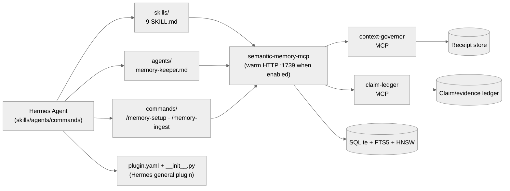

# semantic-memory for Hermes Agent

> **Tier 0 reference implementation.** Manifest-driven skills, hooks, commands, MCP companions, proof helpers, and a memory-keeper subagent — over `semantic-memory-mcp` + `context-governor` + `claim-ledger`. Installs locally (no marketplace).

[](#tier--scope)
[](#)
[](#)
[](https://crates.io/crates/semantic-memory-mcp)
[](https://crates.io/crates/context-governor)
[](https://crates.io/crates/claim-ledger)

See the [top-level README](../../README.md) for the full capability matrix, architecture overview, and Tier 0 vs Tier 1 distinction.

## Tier / scope

Tier 0 host integration. This directory now contains a current Hermes general-plugin manifest (`plugin.yaml` plus `__init__.py`) for guarded MCP setup, alongside the richer kit assets historically described by `plugin.json`. The general plugin is loadable by current Hermes; `plugin.json` remains a kit/deployment manifest and is not itself interpreted by Hermes's general-plugin loader.

## Architecture



Skill paths: `hermes/skills/`. Agent path: `hermes/agents/`. Command paths: `hermes/commands/`. Hermes plugin manifest: `hermes/plugin.yaml`. Kit deployment metadata: `hermes/plugin.json`.

## Install

Install the general plugin from a checkout by copying this directory into the
Hermes user plugin directory, then enable it:

For hosts that use the canonical checkout directly:

```bash
cp -R hermes "$HOME/.hermes/plugins/semantic-memory-mcp"
hermes plugins enable semantic-memory-mcp
hermes mcp add semantic_memory --command semantic-memory-mcp \
  --args --memory-dir "$HOME/.local/share/semantic-memory" --tool-profile agent
hermes mcp test semantic_memory
hermes mcp configure semantic_memory
```

`--args` must be last. Restart Hermes after changing plugin code. The MCP server supplies the `sm_*` tools directly; the general plugin registers only guarded setup helpers. If deploying the richer hooks/skills kit, keep `hermes/` and `shared/` as siblings and set `SEMANTIC_MEMORY_KIT_ROOT` to the checkout.

## What you get

### Skills (9)

`hermes/skills/<name>/SKILL.md`:

| Skill | Purpose |
|---|---|
| `memory-capture` | When and how to save durable facts and decisions |
| `memory-curator` | Reconcile duplicates, supersede stale, prune contradicted |
| `memory-maintenance` | Vacuum, re-embed stale vectors, run `doctor-all` |
| `memory-sync` | Promote facts across namespaces; pair with `ingest_codebase.py` |
| `knowledge-graph-explorer` | Use `sm_topology`, `sm_communities`, `sm_factor_graph` for second-order discovery |
| `release-gate` | Run `cargo fmt --check`, `cargo clippy -- -D warnings`, `cargo test --workspace` and store receipts |
| `context-compaction` | Drive `context-governor-compact.py` before manual or auto compaction |
| `claim-provenance` | Back material assertions with `cl_run` / `cl_evidence` / `cl_verify` |
| `llm-output-parsing` | Use the `sm_parse_*` tools to handle think blocks, malformed JSON, trailing text |

### Agent (1)

- `agents/memory-keeper.md` — subagent that audits memory health, runs the curator, and re-anchors stale facts

### Commands

Declared in `hermes/plugin.json`:

- `/memory-setup` — install binary, allowlist tools, write rules (see `hermes/commands/memory-setup.md`)
- `/memory-ingest <path>` — run `ingest_codebase.py` on a repo path (see `hermes/commands/memory-ingest.md`)
- `/memory-gaps` — inspect semantic-memory coverage gaps (see `hermes/commands/memory-gaps.md`)
- `/evidence-workbench` — create evidence/proof packets from command output (see `hermes/commands/evidence-workbench.md`)
- `/proof-packet` — join receipts into an adjudicated proof packet (see `hermes/commands/proof-packet.md`)

### Scripts

`hermes/scripts/` includes MCP wrappers, doctor/benchmark helpers, ingestion, proof/evidence helpers, admin server launchers, context-governor audit wrappers, and Forge admin wiring. Treat `hermes/plugin.json` plus the script directory as source of truth instead of hardcoding script counts in docs.

Key entries:

- `context-governor-mcp.py` — MCP server entry for `context-governor`
- `claim-ledger-mcp.py` — MCP server entry for `claim-ledger`
- `context-governor-compact.py` — deterministic transcript compaction
- `context-governor-audit.py` — audit wrapper for context-governor high-ROI checks
- `doctor-all.py` — runs all kit doctors and writes a JSON receipt bundle
- `benchmark-retrieval.py` — quality benchmark over warm HTTP
- `benchmark-context-governor.py` — compaction latency / ratio benchmark
- `ingest_codebase.py` — language-agnostic repo ingester
- `evidence-workbench.py`, `proof-packet.py` — proof/evidence packet helpers
- `run-server.sh`, `run-server-admin.sh` — daily and admin semantic-memory launchers
- `forge-admin-mcp.py` — admin-only patch verification MCP wrapper

### Plugin manifest

`hermes/plugin.yaml` and `hermes/__init__.py` are the current loadable Hermes general plugin. `hermes/plugin.json` declares the richer kit's intended skills, hooks, commands, and companion servers for deployment tooling; Hermes does not natively interpret that JSON file.

### MCP tools exposed

`semantic-memory-mcp` tool counts vary by profile (lean/standard/full/admin). Run `python shared/scripts/generate-tool-surface-docs.py --out /tmp/tool-surface.json` for current counts. `context-governor` exposes 13 CLI commands. `claim-ledger` exposes 5 tools. See the [top-level "The three MCP companions" section](../../README.md#the-three-mcp-companions).

The kit manifest starts the daily launcher, which uses warm HTTP port `1739` by default. HTTP requires a Bearer token: set `SEMANTIC_MEMORY_HTTP_TOKEN`, or point `SEMANTIC_MEMORY_HTTP_TOKEN_FILE` at a token file, or create `~/.hermes/semantic-memory-http-1739.token` (mode `600` is recommended). The server launcher and retrieval benchmark pass only token-file paths, never token values in child argv, and redact captured child output. Hook clients allow plaintext HTTP only on loopback, require HTTPS for non-loopback URLs, and never follow redirects with credentials. Set `SEMANTIC_MEMORY_HTTP_PORT=0` for token-free stdio-only MCP operation.

## Receipts

- Top-level doctor: `shared/scripts/doctor-all.py --deep`
- Host-specific doctor: `hermes/scripts/doctor-all.py`
- Hook debug log: `export SEMANTIC_MEMORY_HOOK_DEBUG=~/sm-hooks.log`
- Compaction receipts: `~/.local/share/context-governor/receipts/`
- Claim ledger: append-only JSONL at `~/.local/share/claim-ledger/ledger.jsonl`
- Admin/full MCP profile: use the `semantic-memory-admin` server entry (or run `hermes/scripts/run-server-admin.sh`) for maintenance tools hidden by the daily lean profile.
- Release-gate proof packets: run `hermes/scripts/proof-packet.py` or `shared/scripts/proof-packet.py` to join command receipts with claim/disposition JSON; only disposition `promote` exits 0.

This host has no host-specific `doctor.py` separate from `doctor-all.py`.

## Design principles

Hermes is the third reference impl, focused on minimal installation friction:

- **File install, not marketplace.** Copy the plugin directory and enable it locally.
- **Separate loader and kit metadata.** `plugin.yaml` is Hermes-native; `plugin.json` documents richer deployment assets.
- **One canonical store.** Examples use `~/.local/share/semantic-memory`; select one writer/HTTP owner when running several agents concurrently.

These extend the [top-level Design principles](../../README.md#design-principles); they don't replace them.

## Troubleshooting

| Symptom | Fix |
|---|---|
| Skills not picked up | Confirm `~/.hermes/skills/<skill>/SKILL.md` exists; restart Hermes. |
| Agent not registered | Confirm `~/.hermes/agents/memory-keeper.md` exists; restart Hermes. |
| Warm port conflict with Codex/Claude | Only one process should own a configured warm port. Set `SEMANTIC_MEMORY_HTTP_PORT=0` for stdio-only clients. |
| HTTP launcher reports a missing token | Set `SEMANTIC_MEMORY_HTTP_TOKEN`, `SEMANTIC_MEMORY_HTTP_TOKEN_FILE`, or `~/.hermes/semantic-memory-http-1739.token`; do not put the token in command output or checked-in config. |
| Hook silent | `export SEMANTIC_MEMORY_HOOK_DEBUG=~/sm-hooks.log` and tail. |
| `cargo install` fails | Re-run after `rustup update stable`. |
